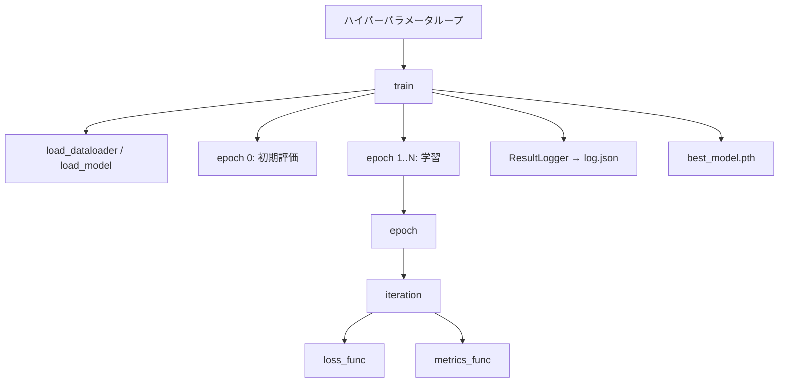

# Deep Variational Information Bottleneck — MNIST 初学者向け講座

PyTorch 初学者が **Deep Variational Information Bottleneck（Deep VIB）** まで段階的に到達できるよう，MNIST を題材に 8 本のノートブックを用意したリポジトリである．各ノートブックは 1 ファイルに完結し，他の `.py` を import しない．

## リポジトリの思想

1. **同じ骨格，差分は最小** — `iteration` / `epoch` / `train` という 3 段の学習ループと，関数名（`load_dataloader`，`loss_func` など）を全実験で揃える．実験ごとの変更はモデル，損失，評価指標に閉じる．
2. **1 ノートブック = 1 実験** — Colab 上でそのまま実行できるよう，必要な関数はすべてノートブック内にハードコーディングする．
3. **数式とコードの対応** — 各ノートブックと解説 Markdown に目的関数とハイパーパラメータを記載し，「どの式を最小化しているか」を常に明示する．

## ファイル構成

| ファイル | 内容 |
|:---|:---|
| `REEDME.md` | 本ドキュメント（リポジトリ全体の説明） |
| `ex001_mnist_nn.ipynb` | 実験001: 全結合 NN + 交差エントロピー |
| `ex001_mnist_nn.md` | 実験001の解説（目的，条件，結果） |
| `ex002_mnist_ae.ipynb` / `.md` | 実験002: Autoencoder |
| `ex003_mnist_vae.ipynb` / `.md` | 実験003: VAE |
| `ex004_mnist_vib.ipynb` / `.md` | 実験004: Deep VIB + 交差エントロピー |
| `ex005_mnist_vib_2d.ipynb` / `.md` | 実験005: Deep VIB 2 次元可視化 |
| `ex006_mnist_nn_adv.ipynb` / `.md` | 実験006: 敵対的学習（ノイズ最適化） |
| `ex007_mnist_vib_brier.ipynb` / `.md` | 実験007: Deep VIB + Brier スコア |
| `ex008_mnist_vib_wce.ipynb` / `.md` | 実験008: Deep VIB + クラス間重み付き CCE |
| `figures/` | 解説 Markdown 用の学習曲線・可視化画像 |

各 `.ipynb` 先頭に **Open in Colab** バッジがある．Colab 上では GPU を有効にして実行する．

## 実験の流れ

| # | 実験 | モデル | 主な損失 | 前実験との主な差分 |
|:---:|:---|:---|:---|:---|
| 001 | MNIST 分類 | 全結合 NN | 交差エントロピー | 講座の基礎。学習ループの型を固定 |
| 002 | 再構成 | Autoencoder | MSE | 教師信号が入力画像自身 |
| 003 | 再構成 | VAE | MSE + KL | 潜在変数が確率分布 |
| 004 | 分類 | Deep VIB | CE + β KL | VAE 型 Encoder + 分類器 |
| 005 | 可視化 | Deep VIB（潜在 2 次元） | CE + β KL | 潜在平面の散布図・決定領域 |
| 006 | 敵対的学習 | 全結合 NN | CE | 入力ノイズを PGD で最適化 |
| 007 | 分類 | Deep VIB | Brier + β KL | 分類項を CE から Brier へ。CCE との学習曲線・2 次元分布を比較 |
| 008 | 分類 | Deep VIB | 重み付き CCE + β KL | 似たクラスの混同をクラス間重み（50 個）で強く罰する |

## 共通ハイパーパラメータ（001〜008）

| 項目 | 値 |
|:---|:---|
| データセット | MNIST（60,000 / 10,000） |
| 前処理 | `ToTensor()` |
| 最適化 | Adam，学習率 0.001 |
| バッチサイズ | 128 |
| エポック | 10（0 エポック目は初期評価） |
| シード | 0 |

Deep VIB 系（004, 005, 007, 008）と VAE（003）では $\beta = 0.001$ を共通に用いる．VAE で $\beta=1$ とすると Posterior Collapse しやすいためである．実験006の敵対的学習では $L_\infty$ 半径 $\epsilon=0.1$，PGD 5 ステップ，$\alpha=0.025$ とする．

## 関数とクラスの役割

学習処理は次のネスト関係で構成する．深いネストを避け，役割ごとに関数を分ける．



| 名前 | 役割 |
|:---|:---|
| `set_seed` | Python / NumPy / PyTorch の乱数固定 |
| `ResultLogger` | エポック指標をリストに蓄え `log.json` へ保存 |
| `load_dataloader` | MNIST の学習・検証 DataLoader を返す |
| `load_model` | モデルを生成し，必要なら重みを読み込む |
| `loss_func` | **実験ごとに差し替える** 目的関数 |
| `metrics_func` | Accuracy，MAE，KL など評価指標 |
| `iteration` | 1 ミニバッチの順伝播と（学習時）逆伝播 |
| `epoch` | DataLoader 1 周分の平均指標 |
| `train` | 全エポックの学習と最良モデル保存 |

`optimizer is None` のとき `iteration` は評価モード（`model.eval()`，`torch.no_grad()`）として動作する．

## 結果の保存先

学習を実行すると，リポジトリ直下に次のディレクトリが作成される（Git 管理外）．

```text
outputs/{実験名}/{最適化手法}/{学習率}_{バッチサイズ}/{seed}/
    best_model.pth
    log.json
datasets/{実験名}/standard/MNIST/   # 初回ダウンロード時
```

同一条件の `log.json` と `best_model.pth` が既にある場合，学習はスキップされる．

## 使い方

1. 実験001から順に `.ipynb` を Colab で開く（またはローカル Jupyter で実行）．
2. 対応する `.md` で目的関数と結果を確認する．
3. `figures/` の画像は `.md` 内で参照される．

## ライセンス・出典

MNIST は Yann LeCun らのデータセットである．Deep VIB の考え方は Alemi et al. の Deep Variational Information Bottleneck に基づく．
