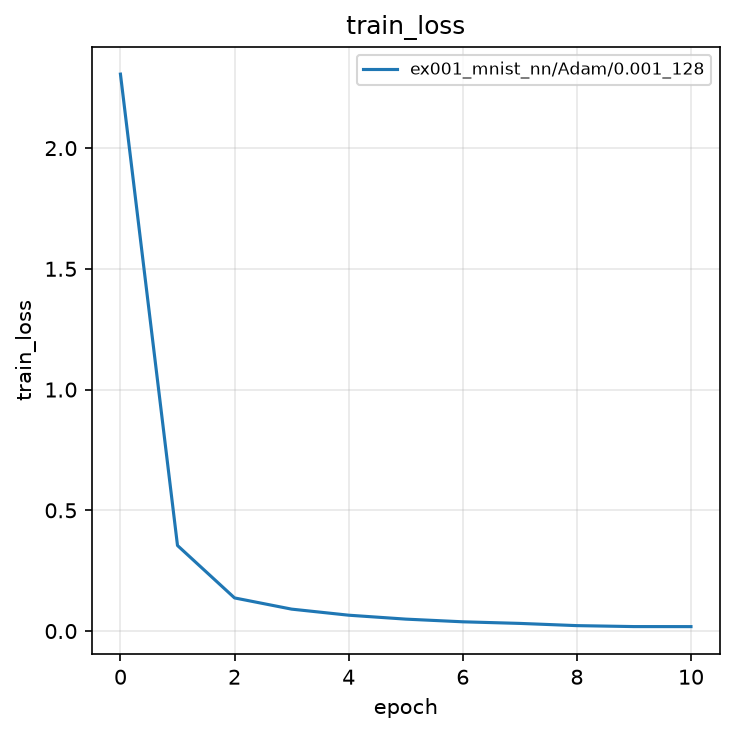
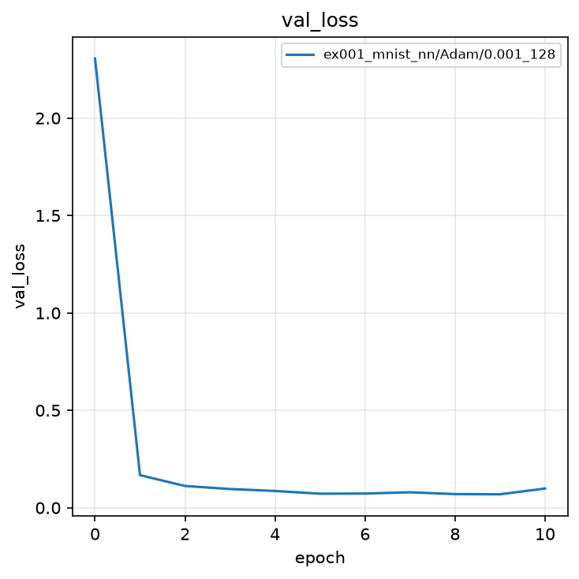
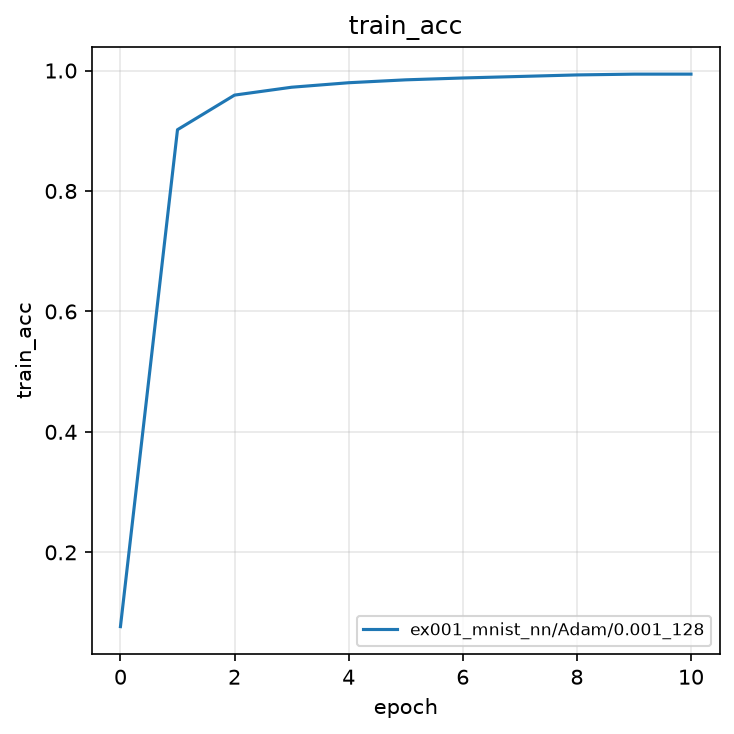
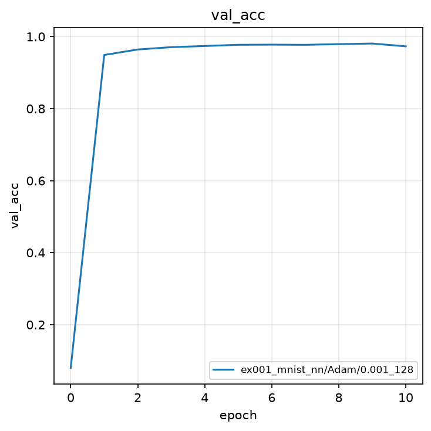

# 実験001: 全結合ニューラルネットワークによる MNIST 分類

## 1. 目的

本実験の目的は，PyTorch 初学者が以降の Autoencoder，VAE，Deep Variational Information Bottleneck（Deep VIB）へ進むための共通基盤として，全結合ニューラルネットワークによる MNIST 10 クラス分類を実装し，交差エントロピー誤差のもとで学習が収束することを確認することである．

講座全体では，誤差関数の変更，2 次元特徴の可視化，敵対的学習（ノイズ最適化）を段階的に扱う．本実験はその第 1 段であり，学習ループの分割（`iteration` / `epoch` / `train`）と結果保存の規則を固定する．

## 2. 手法

### 2.1 モデル

入力は $28 \times 28$ のグレースケール画像である．これを 784 次元ベクトル $\tilde{x}$ へ平坦化し，次の写像でクラスロジット $z \in \mathbb{R}^{10}$ を得る．

$$
h_1 = \mathrm{ReLU}(W_1 \tilde{x} + b_1) \in \mathbb{R}^{256}
$$

$$
h_2 = \mathrm{ReLU}(W_2 h_1 + b_2) \in \mathbb{R}^{128}
$$

$$
z = W_3 h_2 + b_3 \in \mathbb{R}^{10}
$$

予測クラスは $\hat{y} = \arg\max_k z_k$ である．畳み込み層は用いず，全結合層のみで構成する．後続実験で潜在表現や再構成を扱う際の比較基準とするためである．

### 2.2 誤差関数

誤差関数は交差エントロピーである．ミニバッチサイズを $N$，サンプル $n$ の正解クラスを $y_n$，クラス $k$ のロジットを $z_{n,k}$ として，

$$
\mathcal{L} = -\frac{1}{N}\sum_{n=1}^{N}\left(z_{n,y_n} - \log\sum_{k=1}^{10}\exp(z_{n,k})\right)
$$

である．これはソフトマックスと負の対数尤度の合成に等しい．後続実験では，この $\mathcal{L}$ を Autencoder の再構成誤差や VIB の変分下界，独自の誤差関数へ置き換える．

### 2.3 評価指標

評価指標は Accuracy である．

$$
\mathrm{Accuracy} = \frac{1}{N}\sum_{n=1}^{N}\mathbf{1}[\hat{y}_n = y_n]
$$

Loss の計算は `iteration` 内に閉じ，`metrics_func` は Accuracy のみを返す．

## 3. 実験条件

| 項目 | 設定 |
|:---|:---|
| データセット | MNIST（学習 60,000 枚，テスト 10,000 枚） |
| 前処理 | `ToTensor()`（画素値を $[0, 1]$ へ変換） |
| モデル | 全結合 NN（784-256-128-10，ReLU） |
| 最適化手法 | Adam |
| 学習率 | $0.001$ |
| バッチサイズ | $128$ |
| エポック数 | $10$（0 エポック目は初期値評価） |
| シード | $0$（サンプルのため 1 つ） |
| 最良モデルの基準 | 検証 Accuracy の最大値 |

結果の保存先は `outputs/ex001_mnist_nn/Adam/0.001_128/0/` である．

## 4. 実験結果

学習は完了した．0 エポック目（ランダム初期値）の検証 Accuracy は $0.0798$ であり，10 クラスのチャンスレート $0.1$ 近傍である．1 エポック目で検証 Accuracy は $0.9491$ まで上昇し，9 エポック目に最高値 $0.9808$ を記録した．

| epoch | train loss | train acc | val loss | val acc |
|:---:|:---:|:---:|:---:|:---:|
| 0 | 2.3063 | 0.0767 | 2.3060 | 0.0798 |
| 1 | 0.3543 | 0.9018 | 0.1673 | 0.9491 |
| 5 | 0.0495 | 0.9846 | 0.0722 | 0.9773 |
| 9 | 0.0186 | 0.9941 | 0.0691 | **0.9808** |
| 10 | 0.0184 | 0.9941 | 0.0989 | 0.9730 |

最良検証 Accuracy は $0.9808$（epoch 9）である．最終エポックでは検証 Loss が $0.0989$ へ増加し，検証 Accuracy は $0.9730$ へ低下した．学習 Accuracy は $0.9941$ まで上昇しており，過学習の兆候である．`best_model.pth` は検証 Accuracy 最大時点の重みを保持する．

### 4.1 学習曲線

塗りつぶしは seed 間の標準偏差である．本実験は seed が 1 つであるため，区間幅は 0 である．

## 5. 考察

全結合 3 層ネットワークと交差エントロピーのみでも，MNIST 分類は 10 エポック以内に検証 Accuracy 約 $98\%$ へ到達する．画像の空間構造を畳み込みで明示しなくても，784 次元の画素ベクトルから数字の形状を学習できることの確認である．

一方，最終エポックで検証 Loss が再上昇した事実は，交差エントロピー最小化が学習データへの適合を優先しうることを示す．後続の Deep VIB では，目的変数 $Y$ に関する情報 $I(Z; Y)$ を保ちつつ入力 $X$ に関する情報 $I(Z; X)$ を圧縮する．過学習の抑制と特徴の可視化が，本実験のベースラインに対する比較観点となる．

本ノートブックの学習ループは誤差関数を `loss_func` に閉じている．次段の Autoencoder や独自誤差関数では，この関数の中身を差し替えるだけで実験を拡張できる．

## 6. まとめ

- 全結合 NN（784-256-128-10）により MNIST を学習し，最良検証 Accuracy $0.9808$ を得た．
- 学習プログラムは単一の `train.ipynb` に自己完結させ，以降の実験と関数分割を揃えた．
- 結果は `outputs/ex001_mnist_nn/Adam/0.001_128/0/` に保存し，`visualize_result.ipynb` で学習曲線を出力した．
