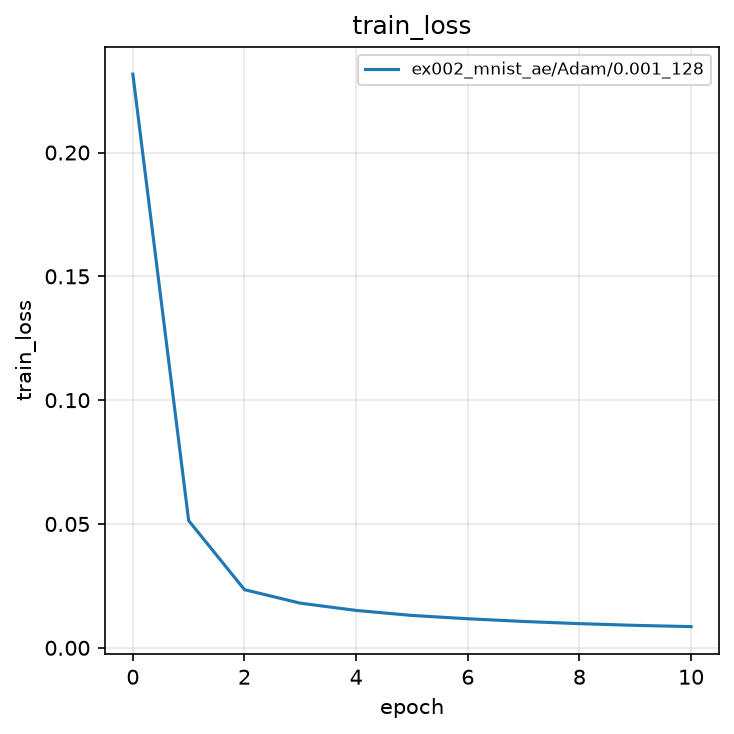
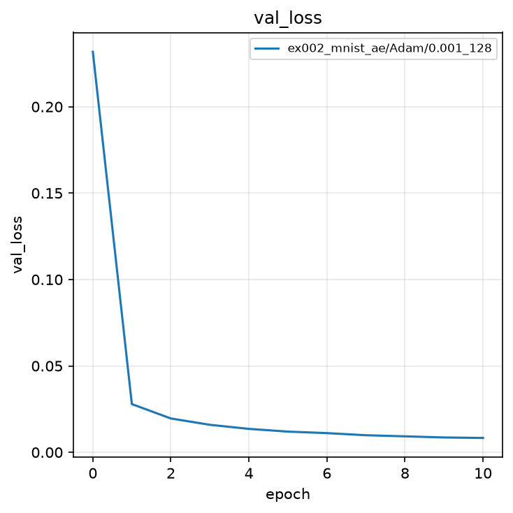
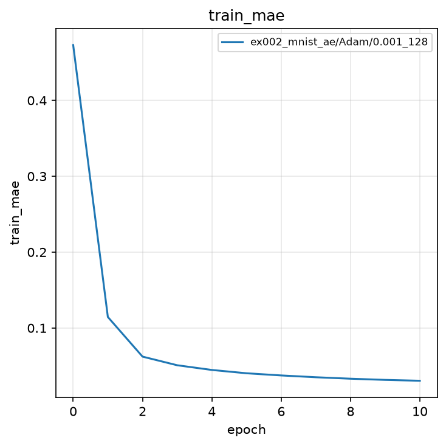
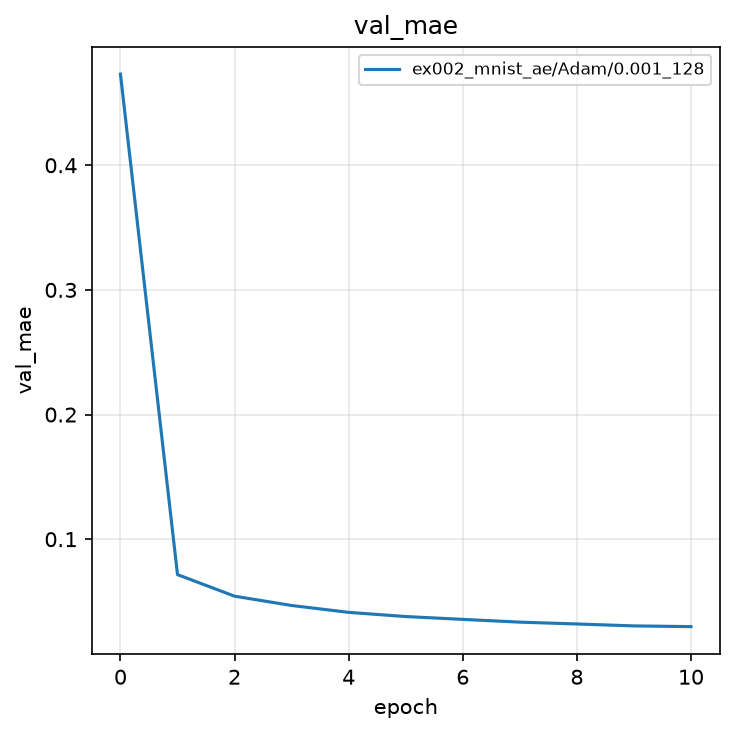
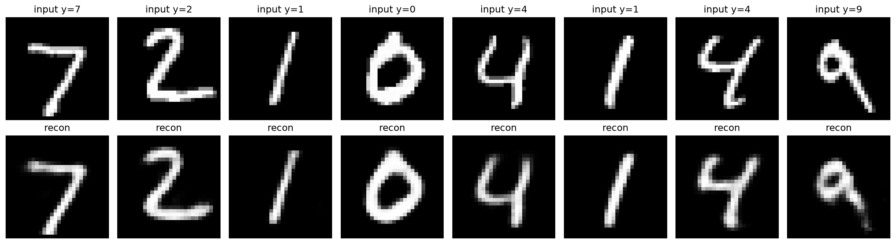

# 実験002: Autoencoder による MNIST の再構成

## 1. 目的

本実験の目的は，実験001の分類器を Encoder–Decoder 構造へ置き換え，クラスラベルを用いずに入力画像自身を再構成する Autoencoder を学習することである．教師信号がラベル $y$ ではなく入力 $x$ である点を確認し，後続の Variational Autoencoder（VAE）および Deep Variational Information Bottleneck（Deep VIB）で用いる潜在ベクトル $z$ の役割を導入する．

## 2. 手法

### 2.1 モデル

入力は $28 \times 28$ のグレースケール画像 $x$ である．これを 784 次元ベクトル $\tilde{x}$ へ平坦化したのち，Encoder で潜在ベクトル $z \in \mathbb{R}^{32}$ へ圧縮し，Decoder で画像 $\hat{x}$ を再構成する．

Encoder:

$$
h_1 = \mathrm{ReLU}(W_1^{(e)}\tilde{x} + b_1^{(e)}) \in \mathbb{R}^{256}
$$

$$
h_2 = \mathrm{ReLU}(W_2^{(e)} h_1 + b_2^{(e)}) \in \mathbb{R}^{128}
$$

$$
z = W_3^{(e)} h_2 + b_3^{(e)} \in \mathbb{R}^{32}
$$

Decoder:

$$
h_1' = \mathrm{ReLU}(W_1^{(d)} z + b_1^{(d)}) \in \mathbb{R}^{128}
$$

$$
h_2' = \mathrm{ReLU}(W_2^{(d)} h_1' + b_2^{(d)}) \in \mathbb{R}^{256}
$$

$$
\hat{x} = \sigma(W_3^{(d)} h_2' + b_3^{(d)}) \in \mathbb{R}^{784}
$$

ここで $\sigma$ は Sigmoid 関数であり，再構成画素を $[0, 1]$ に収める．$\hat{x}$ は形状 $(N, 1, 28, 28)$ へ戻して出力する．潜在次元は 32 とする．2 次元での散布図可視化は後の実験で扱う．

実験001の分類器（784-256-128-10）に対し，本モデルは 128 次元の直後に 32 次元のボトルネックを置き，そこから画像へ戻す点が相違である．

### 2.2 誤差関数

誤差関数は平均二乗誤差（MSE）である．ミニバッチサイズを $N$，画素インデックスを $i$，1 画像の画素数を $D=784$ として，

$$
\mathcal{L} = \frac{1}{ND}\sum_{n=1}^{N}\sum_{i=1}^{D}(\hat{x}_{n,i} - x_{n,i})^2
$$

である．教師信号はクラスラベルではなく入力 $x$ 自身である．

### 2.3 評価指標

評価指標は平均絶対誤差（MAE）である．Loss は `iteration` 内で計算するため，`metrics_func` では MAE のみを返す．

$$
\mathrm{MAE} = \frac{1}{ND}\sum_{n=1}^{N}\sum_{i=1}^{D}|\hat{x}_{n,i} - x_{n,i}|
$$

最良モデルの選択基準は検証 MSE の最小値である．

## 3. 実験条件

| 項目 | 設定 |
|:---|:---|
| データセット | MNIST（学習 60,000 枚，テスト 10,000 枚） |
| 前処理 | `ToTensor()`（画素値を $[0, 1]$ へ変換） |
| モデル | 全結合 Autoencoder（Encoder 784-256-128-32，Decoder 32-128-256-784，出力 Sigmoid） |
| 最適化手法 | Adam |
| 学習率 | $0.001$ |
| バッチサイズ | $128$ |
| エポック数 | $10$（0 エポック目は初期値評価） |
| シード | $0$（サンプルのため 1 つ） |
| 最良モデルの基準 | 検証 MSE の最小値 |

結果の保存先は `outputs/ex002_mnist_ae/Adam/0.001_128/0/` である．

## 4. 実験結果

学習は完了した．0 エポック目の検証 MSE は $0.2318$，検証 MAE は $0.4731$ である．画素値が $[0, 1]$ のとき，ランダム初期値の再構成は入力とほぼ無相関であり，MAE が $0.5$ 近傍となることは自然である．1 エポック目で検証 MSE は $0.0279$ まで低下し，10 エポック目に最小値 $0.0083$ を記録した．検証曲線は単調減少であり，実験001で見られた最終エポックの検証悪化は本設定では現れなかった．

| epoch | train MSE | train MAE | val MSE | val MAE |
|:---:|:---:|:---:|:---:|:---:|
| 0 | 0.2317 | 0.4730 | 0.2318 | 0.4731 |
| 1 | 0.0514 | 0.1145 | 0.0279 | 0.0716 |
| 5 | 0.0131 | 0.0403 | 0.0120 | 0.0379 |
| 10 | 0.0086 | 0.0305 | **0.0083** | **0.0299** |

最良検証 MSE は $0.0083$（epoch 10）である．

### 4.1 学習曲線

塗りつぶしは seed 間の標準偏差である．本実験は seed が 1 つであるため，区間幅は 0 である．

### 4.2 再構成画像

上段が入力，下段が再構成である．検証バッチの数字 7, 2, 1, 0, 4, 1, 4, 9 はいずれも識別可能な形で復元された．再構成は入力よりやや平滑であり，32 次元への圧縮に伴う高周波成分の欠落である．

## 5. 考察

ラベルを使わず画素の MSE のみを最小化しても，MNIST の字形は 32 次元の $z$ に保持される．実験001が $I(Z; Y)$ に相当する識別情報を直接最大化したのに対し，本実験は入力の再構成，すなわち $X$ の情報を $Z$ に残す方向の学習である．Deep VIB ではこの 2 つを同時に扱い，$I(Z; Y)$ を保ちつつ $I(Z; X)$ を抑える．

再構成がややぼやける現象は，決定的な Encoder が入力を 1 点 $z$ へ写すことと，MSE が画素平均の誤差を最小にすることの帰結である．次段の VAE では $q(z|x)$ を分布として学習し，潜在空間の連続性を明示する．

学習ループを変えずに `loss_func` と教師信号の与え方だけを差し替えたことで，分類から再構成への移行が追跡可能である．これが本講座で関数分割を固定する理由である．

## 6. まとめ

- 全結合 Autoencoder（潜在次元 32）により MNIST を再構成し，最良検証 MSE $0.0083$，MAE $0.0299$ を得た．
- 検証画像の数字は識別可能な形で復元され，再構成は入力より平滑である．
- プログラムは実験001と同じ関数分割を保ち，教師信号を入力自身へ変更した．
- 結果は `outputs/ex002_mnist_ae/Adam/0.001_128/0/` に保存した．
