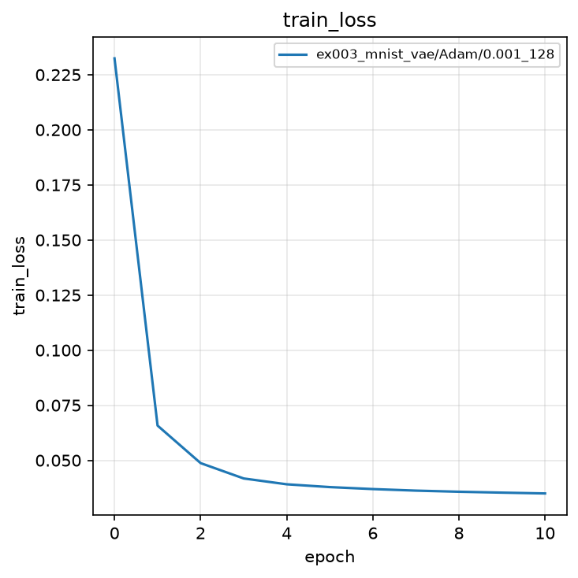
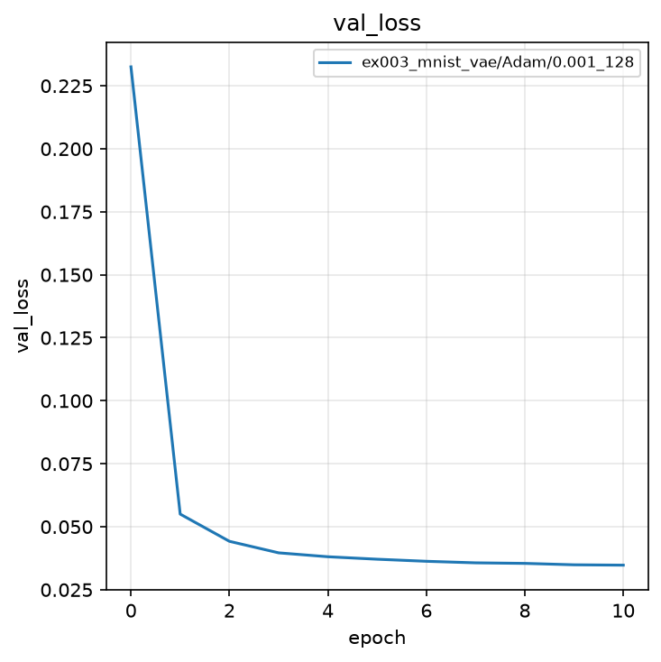
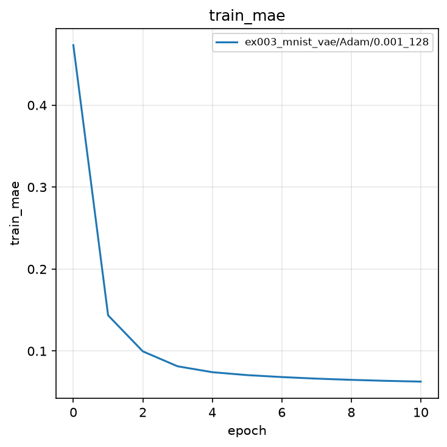
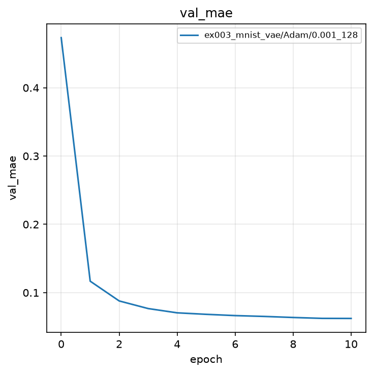
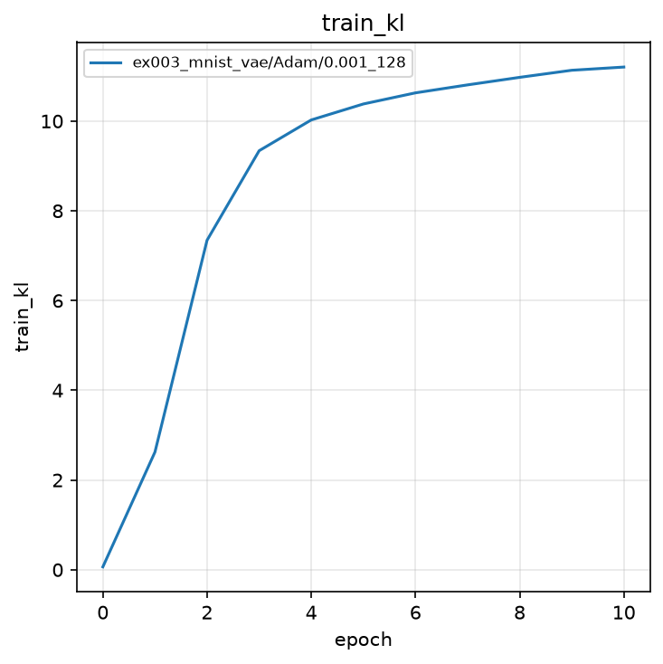
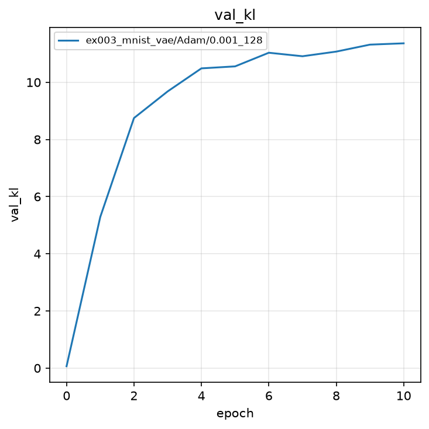
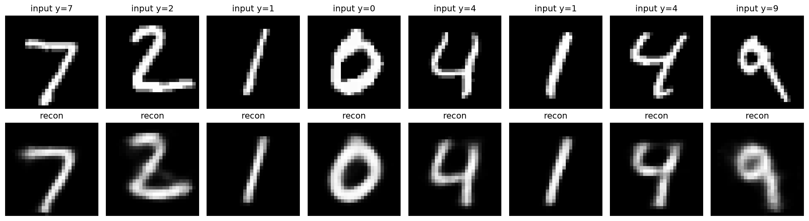

# 実験003: Variational Autoencoder による MNIST の再構成

## 1. 目的

本実験の目的は，実験002の決定的 Autoencoder を Variational Autoencoder（VAE）へ拡張し，潜在変数 $z$ を分布 $q(z|x)$ として学習することである．再構成誤差に KL ダイバージェンスを加えた ELBO を最小化することで，後続の Deep Variational Information Bottleneck（Deep VIB）で扱う確率的潜在表現の基礎を確認する．

## 2. 手法

### 2.1 モデル

入力は $28 \times 28$ のグレースケール画像 $x$ である．Encoder は $q(z|x)=\mathcal{N}(\mu, \mathrm{diag}(\sigma^2))$ のパラメータ $\mu$ と $\log\sigma^2$（各 32 次元）を出力する．

Encoder:

$$
h_1 = \mathrm{ReLU}(W_1^{(e)}\tilde{x} + b_1^{(e)}) \in \mathbb{R}^{256}
$$

$$
h_2 = \mathrm{ReLU}(W_2^{(e)} h_1 + b_2^{(e)}) \in \mathbb{R}^{128}
$$

$$
\mu = W_\mu h_2 + b_\mu \in \mathbb{R}^{32},\quad
\log\sigma^2 = W_{\log\sigma^2} h_2 + b_{\log\sigma^2} \in \mathbb{R}^{32}
$$

Reparameterization Trick により，

$$
z = \mu + \epsilon \odot \exp(0.5\log\sigma^2),\quad \epsilon \sim \mathcal{N}(0, I)
$$

Decoder は実験002と同型である．

$$
h_1' = \mathrm{ReLU}(W_1^{(d)} z + b_1^{(d)}) \in \mathbb{R}^{128}
$$

$$
h_2' = \mathrm{ReLU}(W_2^{(d)} h_1' + b_2^{(d)}) \in \mathbb{R}^{256}
$$

$$
\hat{x} = \sigma(W_3^{(d)} h_2' + b_3^{(d)}) \in \mathbb{R}^{784}
$$

可視化用の `reconstruct` はサンプリングを行わず，$\mu$ を Decoder へ渡す．

### 2.2 誤差関数

VAE の目的関数は，再構成誤差と KL の加重和である（$\beta$-VAE）．

$$
\mathcal{L} = \mathcal{L}_{\mathrm{recon}} + \beta \mathcal{L}_{\mathrm{KL}},\quad \beta=0.001
$$

再構成誤差は MSE である．

$$
\mathcal{L}_{\mathrm{recon}} = \frac{1}{ND}\sum_{n=1}^{N}\sum_{i=1}^{D}(\hat{x}_{n,i} - x_{n,i})^2,\quad D=784
$$

KL 項は $q(z|x)$ と事前分布 $p(z)=\mathcal{N}(0,I)$ の KL ダイバージェンスである．

$$
\mathcal{L}_{\mathrm{KL}} = -\frac{1}{2N}\sum_{n=1}^{N}\sum_{j=1}^{J}\left(1 + \log\sigma_{n,j}^2 - \mu_{n,j}^2 - \sigma_{n,j}^2\right)
$$

ここで $J=32$ は潜在次元である．

### 2.3 評価指標

評価指標は再構成 MAE と KL である．Loss は `iteration` 内で計算するため，`metrics_func` では MAE と KL のみを返す．最良モデルの選択基準は検証 ELBO 損失（`val_loss`）の最小値である．

## 3. 実験条件

| 項目 | 設定 |
|:---|:---|
| データセット | MNIST（学習 60,000 枚，テスト 10,000 枚） |
| 前処理 | `ToTensor()`（画素値を $[0, 1]$ へ変換） |
| モデル | 全結合 VAE（Encoder 784-256-128-($\mu$,$\log\sigma^2$)，Decoder 32-128-256-784，Sigmoid） |
| 潜在次元 | $32$ |
| $\beta$ | $0.001$（後続の Deep VIB と同じ） |
| 最適化手法 | Adam |
| 学習率 | $0.001$ |
| バッチサイズ | $128$ |
| エポック数 | $10$（0 エポック目は初期値評価） |
| シード | $0$（サンプルのため 1 つ） |
| 最良モデルの基準 | 検証 ELBO 損失の最小値 |

結果の保存先は `outputs/ex003_mnist_vae/Adam/0.001_128/0/` である．

### 実験前に考える

ノートブックを実行する前に，次の問いに自分の言葉で答えてください．

1. Autoencoder の $z$ は 1 点でした．これを分布 $q(z|x)$ にすると，再構成は良くなると思いますか，悪くなると思いますか．
2. KL 項は $q(z|x)$ を $\mathcal{N}(0,I)$ へ近づけます．$\beta$ を大きくすると，再構成と圧縮のどちらが勝つと思いますか．
3. $\beta=1$ と $\beta=0.001$ では，どちらが数字の形を保ちやすいと思いますか．


## 4. 実験結果

<details>
<summary>実験結果を見る（先に予想してから開く）</summary>

学習は完了した．0 エポック目の検証損失は $0.2325$，検証 MAE は $0.4734$ である．KL 項は潰れることなく $11$ 前後へ収束し，10 エポック目に最良検証 Loss $0.0348$，MAE $0.0622$ を得た．

| epoch | train Loss | train MAE | train KL | val Loss | val MAE | val KL |
|:---:|:---:|:---:|:---:|:---:|:---:|:---:|
| 0 | 0.2324 | 0.4732 | 0.0649 | 0.2325 | 0.4734 | 0.0650 |
| 1 | 0.0658 | 0.1436 | 2.62 | 0.0550 | 0.1168 | 5.29 |
| 8 | 0.0357 | 0.0649 | 10.98 | 0.0355 | 0.0636 | 11.07 |
| 10 | 0.0350 | 0.0627 | 11.20 | **0.0348** | **0.0622** | 11.36 |

実験002（Autoencoder）の最良検証 MAE $0.0299$ より再構成は滑らかだが，数字の形は復元できている．$\beta=1$ の素朴な ELBO では KL が 0 に潰れやすいため，後続の Deep VIB と同じ $\beta=0.001$ を用いた．

### 4.1 学習曲線













### 4.2 再構成画像



上段が入力，下段が再構成である．各数字の形は保持されており，入力より輪郭がやや滑らかである．これは KL 正則化により潜在表現が連続的になることの表れである．

</details>

### 実験後に考える

1. KL は 0 に潰れましたか，それとも 11 前後に残りましたか．実験前の予想と一致しましたか．
2. Autoencoder より MAE が大きいのに，再構成の輪郭が滑らかなのはなぜでしょうか．
3. 「不要な情報を捨てたい」とき，KL は情報量のどの側面を制御していると考えられますか．

## 5. 考察

<details>
<summary>解説を見る</summary>


VAE は Autoencoder に KL 正則化を加えることで，潜在空間を連続的かつ生成可能な分布として学習する．$\beta=1$ だと再構成より圧縮が勝ち，Posterior Collapse（$q(z|x)\approx p(z)$）が起きやすい．本実験では後続の Deep VIB と同じ $\beta=0.001$ を用い，KL を $11$ 前後に保ったまま再構成 MAE $0.0622$ まで学習した．

Deep VIB でも同じ $\beta$ を分類損失と組み合わせる．VAE で確認した「再構成と圧縮のトレードオフ」は，情報ボトルネックの動機付けに直結する．

</details>

## 6. まとめ

- 全結合 $\beta$-VAE（潜在次元 32，$\beta=0.001$）により MNIST を学習し，最良検証 Loss $0.0348$，MAE $0.0622$ を得た．
- KL 項は約 $11$ へ収束し，Posterior Collapse は起きなかった．
- 再構成は Autoencoder（MAE $0.0299$）より滑らかだが，数字の形は復元できる．
- この $\beta$ は実験004以降の Deep VIB でも共通である．
- 結果は `outputs/ex003_mnist_vae/Adam/0.001_128/0/` に保存した．

## 7. 発展課題

### 課題

$\beta$ を変えて，再構成の綺麗さと KL の大きさのトレードオフを自分で測ってください．

1. **何を変更するか**: `BETA = 0.001` を `1.0` および `0.0001` にする（1 条件ずつ学習する）．
2. **何を比較するか**: 検証 MAE，検証 KL，再構成画像の判読しやすさ．
3. **予想**: $\beta=1$ では KL が小さく（場合によってほぼ 0），再構成は潰れる（Posterior Collapse）可能性が高いです．$\beta=0.0001$ では KL が大きく，再構成は Autoencoder に近づきます．

<details>
<summary>回答例を見る</summary>

```python
BETA = 1.0  # または 0.0001
```

条件ごとに保存先が重ならないよう，学習後に `log.json` を別名でコピーするか，`EXPERIMENT_NAME` を `ex003_mnist_vae_beta1` のように変えて実行してください．

### 実験方法

各 $\beta$ で 10 エポック学習し，最終の `val_mae` と `val_kl`，再構成画像を表にまとめます．

### 期待される結果

$\beta=1$ では KL が非常に小さく，数字が判別しにくい再構成になりやすいです．$\beta=0.0001$ では KL が大きく，MAE は本実験（$0.0622$）より小さくなります．

### 結果から分かること

KL は「圧縮の強さ」のつまみです．後続の Deep VIB が同じ $\beta=0.001$ を使うのは，識別に必要な情報を残しつつ，入力の余剰を抑えられる地点を VAE で先に確認したためです．

</details>
