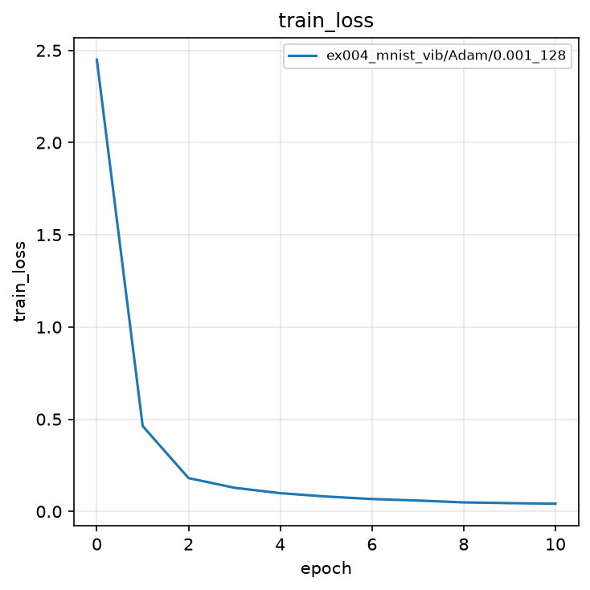
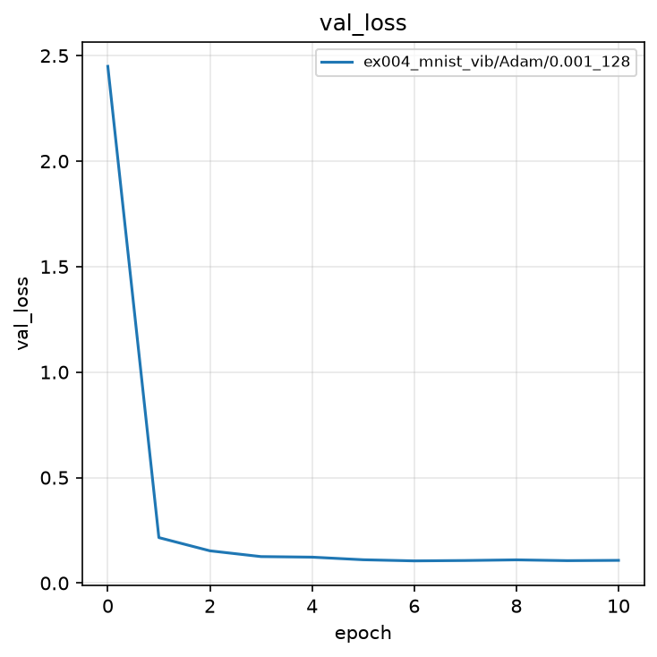
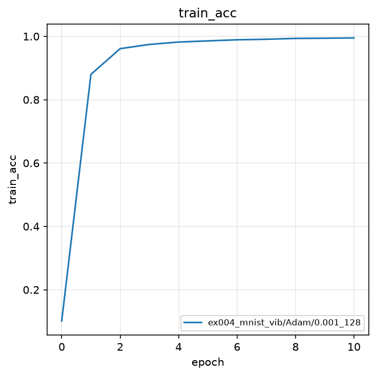
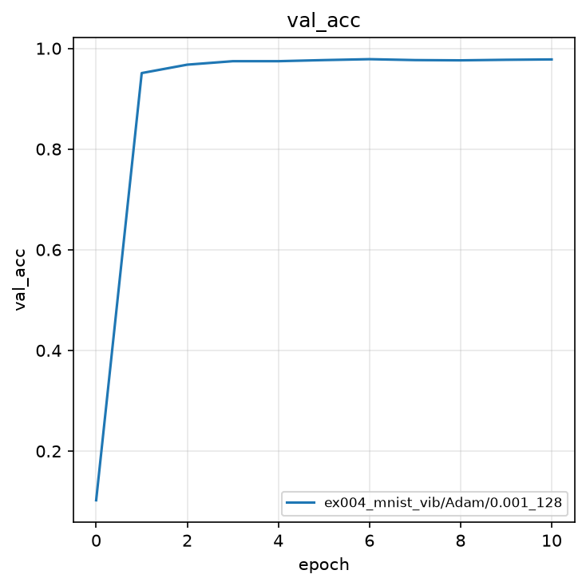
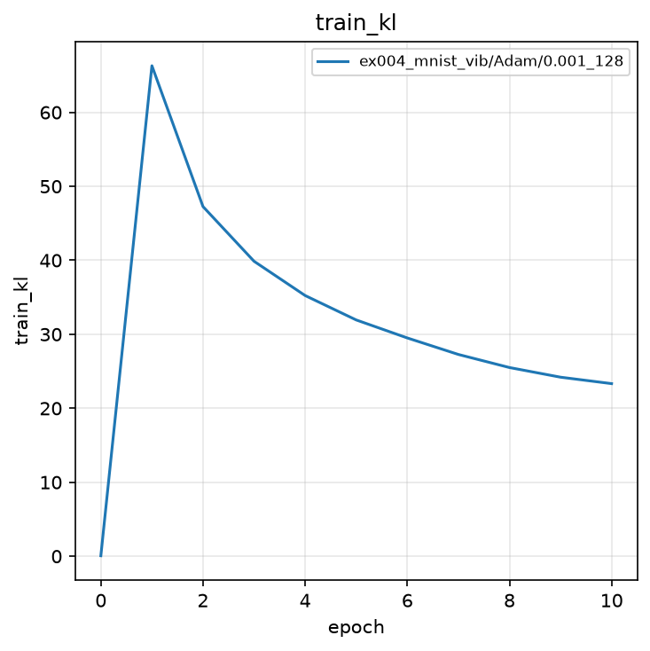
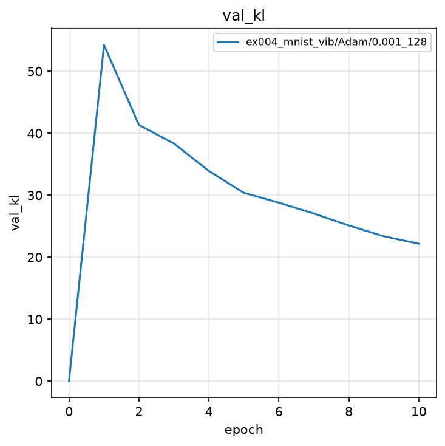

# 実験004: Deep Variational Information Bottleneck による MNIST 分類

## 1. 目的

本実験の目的は，実験001の分類器と実験003の確率的 Encoder を組み合わせ，分類に必要な情報だけを潜在変数へ残す枠組みを実装することである．その枠組みが Deep Variational Information Bottleneck（Deep VIB）である．なぜ圧縮が必要か，残っている情報をどう測り，どの損失で実装するかは，2.2 節から順を追う．

## 2. 手法

### 2.1 モデル

入力は $28 \times 28$ のグレースケール画像 $x$ である．Encoder は実験003と同様，$q(z|x)=\mathcal{N}(\mu, \mathrm{diag}(\sigma^{2}))$ のパラメータ $\mu$ と $\log\sigma^{2}$（各 32 次元）を出力する．

Encoder:

$$
h_{1} = \mathrm{ReLU}(W_{1}^{(e)}\tilde{x} + b_{1}^{(e)}) \in \mathbb{R}^{256}
$$

$$
h_{2} = \mathrm{ReLU}(W_{2}^{(e)} h_{1} + b_{2}^{(e)}) \in \mathbb{R}^{128}
$$

$$
\mu = W_{\mu} h_{2} + b_{\mu} \in \mathbb{R}^{32},\quad
\log\sigma^{2} = W_{\log\sigma^{2}} h_{2} + b_{\log\sigma^{2}} \in \mathbb{R}^{32}
$$

Reparameterization Trick により，

$$
z = \mu + \epsilon \odot \exp(0.5\log\sigma^{2}),\quad \epsilon \sim \mathcal{N}(0, I)
$$

Classifier は潜在ベクトル $z$ から 10 クラスのロジットを計算する．実験003の Decoder（画像再構成）を分類ヘッドへ置き換えた構造である．

$$
\ell = W_{\mathrm{out}} z + b_{\mathrm{out}} \in \mathbb{R}^{10}
$$

予測クラスは $\hat{y} = \operatorname{argmax}_{k} \ell_{k}$ である．可視化用の `predict` はサンプリングを行わず，$\mu$ を分類器へ渡す．

次の問いに自分の仮説を書いてから，2.2 節へ進む．

1. MNIST の「7」を分類するために，画像の全画素情報は本当に必要か．
2. $x \rightarrow z \rightarrow y$ としたとき，$z$ に分類に不要な情報まで残っていたら，何が起きるか．
3. 必要な情報は残したい，不要な情報は捨てたい，というとき，「残っている情報量」をどう評価すればよいか．

### 2.2 なぜ情報を圧縮するのか

実験001は画素から直接 $Y$ を予測した．実験002・003は $X$ を $z$ に通して再構成した．分類だけが目的なら，$z$ に残すべきなのは $Y$ の予測に効く情報である．$x \rightarrow z \rightarrow y$ としたとき，$z$ に筆圧の揺れや背景の変動など，分類に不要な成分まで残すと，学習データには合っても検証では汎化しにくい．

必要な情報は残したい．不要な情報は捨てたい．残っている情報量を相互情報量で表すと，$I(Z; Y)$ は大きく，$I(Z; X)$ は小さくしたい．これが Information Bottleneck である．実装では相互情報量を直接計算できないため，変分近似により次の和として書く．交差エントロピーが $I(Z; Y)$ を押し上げ，KL が $I(Z; X)$ の上界を抑える．

### 2.3 誤差関数

Information Bottleneck の目的は次のトレードオフである．

$$
\min I(Z; X) - \beta^{-1} I(Z; Y)
$$

Deep VIB ではこれを次の損失で近似する．

$$
\mathcal{L} = \mathcal{L}_{\mathrm{CE}} + \beta \mathcal{L}_{\mathrm{KL}}
$$

交差エントロピー $\mathcal{L}_{\mathrm{CE}}$ は $I(Z; Y)$ の変分下界の負に対応する．ミニバッチサイズを $N$，サンプル $n$ の正解クラスを $y_{n}$，クラス $k$ のロジットを $\ell_{n,k}$ として，

$$
\mathcal{L}_{\mathrm{CE}} = -\frac{1}{N}\sum_{n=1}^{N}\left(\ell_{n,y_{n}} - \log\sum_{k=1}^{10}\exp(\ell_{n,k})\right)
$$

KL 項は $q(z|x)$ と事前分布 $p(z)=\mathcal{N}(0,I)$ の KL ダイバージェンスであり，$I(Z; X)$ の上界である．

$$
\mathcal{L}_{\mathrm{KL}} = -\frac{1}{2N}\sum_{n=1}^{N}\sum_{j=1}^{J}\left(1 + \log\sigma_{n,j}^{2} - \mu_{n,j}^{2} - \sigma_{n,j}^{2}\right)
$$

ここで $J=32$ は潜在次元，$\beta=0.001$ は圧縮の強さを決める係数である．

### 2.4 評価指標

評価指標は Accuracy と KL である．Loss は `iteration` 内で計算するため，`metrics_func` では Accuracy と KL のみを返す．最良モデルの選択基準は検証 Accuracy の最大値である．

$$
\mathrm{Accuracy} = \frac{1}{N}\sum_{n=1}^{N}\mathbf{1}[\hat{y}_{n} = y_{n}]
$$

## 3. 実験条件

| 項目 | 設定 |
|:---|:---|
| データセット | MNIST（学習 60,000 枚，テスト 10,000 枚） |
| 前処理 | `ToTensor()`（画素値を $[0, 1]$ へ変換） |
| モデル | 全結合 Deep VIB（Encoder 784-256-128-($\mu$, $\log\sigma^{2}$)，Classifier 32-10） |
| 潜在次元 | $32$ |
| $\beta$ | $0.001$ |
| 最適化手法 | Adam |
| 学習率 | $0.001$ |
| バッチサイズ | $128$ |
| エポック数 | $10$（0 エポック目は初期値評価） |
| シード | $0$（サンプルのため 1 つ） |
| 最良モデルの基準 | 検証 Accuracy の最大値 |

結果の保存先は `outputs/ex004_mnist_vib/Adam/0.001_128/0/` である．

### 実験前に考える

ノートブックを実行する前に，次の問いに自分の言葉で答えよ．

1. 実験001（交差エントロピーだけ）と比べて，ボトルネックを挟むと検証 Accuracy は下がると考えるか．
2. 実験003の VAE では KL が 0 に潰れなかった．分類損失に差し替えた本実験では，KL は 0 に潰れると考えるか．
3. 学習 Accuracy が $99\%$ 付近まで上がったとき，検証 Accuracy も同じだけ上がると考えるか．


## 4. 実験結果

<details>
<summary>実験結果を見る（先に予想してから開く）</summary>

学習は完了した．0 エポック目の検証 Accuracy は $0.1023$ であり，10 クラスのチャンスレート近傍である．1 エポック目で検証 Accuracy は $0.9509$ まで上昇し，6 エポック目に最高値 $0.9785$ を記録した．

| epoch | train Loss | train acc | train KL | val Loss | val acc | val KL |
|:---:|:---:|:---:|:---:|:---:|:---:|:---:|
| 0 | 2.4502 | 0.1014 | 0.0649 | 2.4494 | 0.1023 | 0.0650 |
| 1 | 0.4634 | 0.8799 | 66.30 | 0.2155 | 0.9509 | 54.23 |
| 6 | 0.0674 | 0.9891 | 29.51 | 0.1051 | **0.9785** | 28.80 |
| 10 | 0.0421 | 0.9948 | 23.33 | 0.1075 | 0.9780 | 22.18 |

最良検証 Accuracy は $0.9785$（epoch 6）である．実験001の全結合 NN（最良検証 Accuracy $0.9808$）とほぼ同水準である．KL は学習開始直後に上昇したのち緩やかに減少し，最終エポックでも $22.18$ を保った．実験003の $\beta$-VAE と同じ $\beta=0.001$ を用いる．

### 4.1 学習曲線













塗りつぶしは seed 間の標準偏差である．本実験は seed が 1 つであるため，区間幅は 0 である．

### 4.2 予測例


検証バッチの数字 7, 2, 1, 0, 4, 1, 4, 9 はいずれも正解ラベルと一致した．

</details>

### 実験後に考える

1. 検証 Accuracy は実験001（$0.9808$）と比べてどうであったか．ボトルネックを挟んでも精度が大きく落ちなかったことから，何が分かるか．
2. KL は 0 に潰れたか．交差エントロピーが $I(Z; Y)$ を押し上げることと，どう関係するか．
3. 学習 Accuracy は $0.9948$，検証は $0.9780$ 付近である．$\beta$ を大きくすると，この差はどうなると考えるか．
4. 「不要な情報を捨てたい」は，実装ではどの項が担っているか．

## 5. 考察

<details>
<summary>解説を見る</summary>

Deep VIB は VAE と同じ確率的 Encoder を用いるが，目的が再構成ではなく分類である．交差エントロピーが $I(Z; Y)$ を押し上げるため，$q(z|x)$ はラベル識別に必要な情報を潜在空間へ残す．その結果，KL は 0 へ潰れず，VAE で観測した Posterior Collapse を回避できた．

検証 Accuracy は実験001の決定的分類器とほぼ同等であり，32 次元の確率的ボトルネックを挟んでも識別性能が大きく落ちないことを示す．一方，最終エポックで学習 Accuracy は $0.9948$ まで上昇し，検証 Accuracy は $0.9780$ で頭打ちである．$\beta$ を大きくすると圧縮が強まり，過学習の抑制が期待できる．次段の 2 次元特徴マップ可視化では，この潜在空間がクラスごとに分離しているかを直接確認する．

</details>

## 6. まとめ

- 全結合 Deep VIB（潜在次元 32，$\beta=0.001$）により MNIST を分類し，最良検証 Accuracy $0.9785$ を得た．
- KL は最終エポックでも約 $22$ を保ち，VAE で生じた Posterior Collapse は観測されなかった．
- 分類性能は実験001の全結合 NN（$0.9808$）とほぼ同水準である．
- 結果は `outputs/ex004_mnist_vib/Adam/0.001_128/0/` に保存した．

## 7. 発展課題

### 課題

圧縮の強さ $\beta$ を変えて，識別精度と KL（圧縮の指標）がどう動くかを調べよ．これが Information Bottleneck のトレードオフそのものである．

1. **何を変更するか**: `BETA = 0.001` を `0.01` と `0.0001` にする．
2. **何を比較するか**: 最良検証 Accuracy と，最終付近の検証 KL．
3. **予想**: $\beta$ を大きくすると KL は小さく（圧縮が強い），Accuracy はわずかに下がる可能性がある．$\beta$ を小さくすると KL は大きく，実験001の全結合分類器に近づく．

<details>
<summary>回答例を見る</summary>

```python
BETA = 0.01  # 圧縮を強める例
```

```python
def loss_func(outputs, teacher_signals):
    logits = outputs["logits"]
    mu = outputs["mu"]
    logvar = outputs["logvar"]
    class_loss = F.cross_entropy(logits, teacher_signals)
    kl_loss = kl_divergence(mu, logvar)
    loss = class_loss + BETA * kl_loss
    return loss
```

`loss_func` 自体は変えなくてよく，`BETA` だけ変えれば十分である．条件ごとに出力ディレクトリが衝突しないよう，学習前に既存の `outputs/ex004_mnist_vib/Adam/0.001_128/0/` を退避せよ．

### 実験方法

各 $\beta$ で seed 0，10 エポック学習し，`val_acc` の最大と最終 `val_kl` を表にまとめよ．

### 期待される結果

$\beta=0.001$ では検証 Accuracy 約 $0.978$，KL 約 $22$ である．$\beta$ を 10 倍にすると KL は下がりやすく，Accuracy は同水準かやや低下する．

### 結果から分かること

目的関数 $\mathcal{L}_{\mathrm{CE}} + \beta \mathcal{L}_{\mathrm{KL}}$ は，「$I(Z;Y)$ を大きくしたい」「$I(Z;X)$ を小さくしたい」を実装可能な和にしたものである．$\beta$ はその比重である．

</details>
