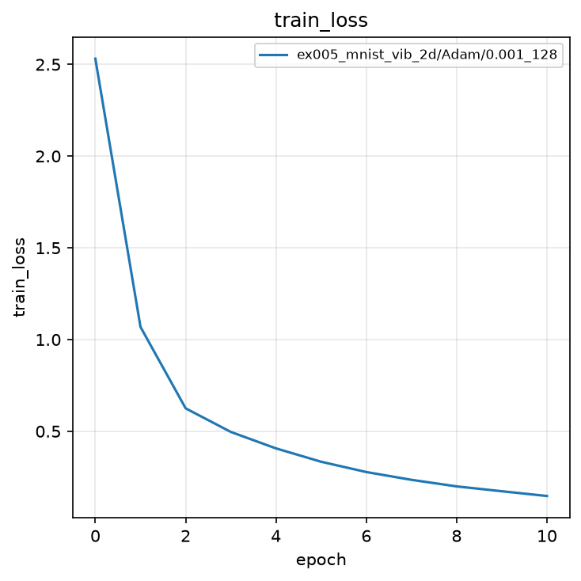
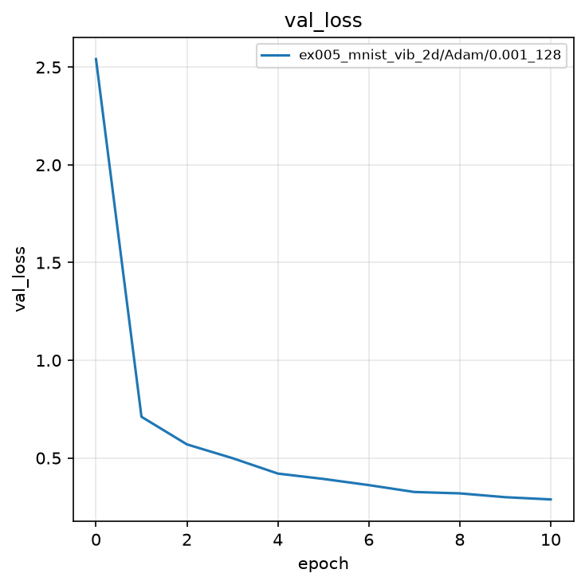
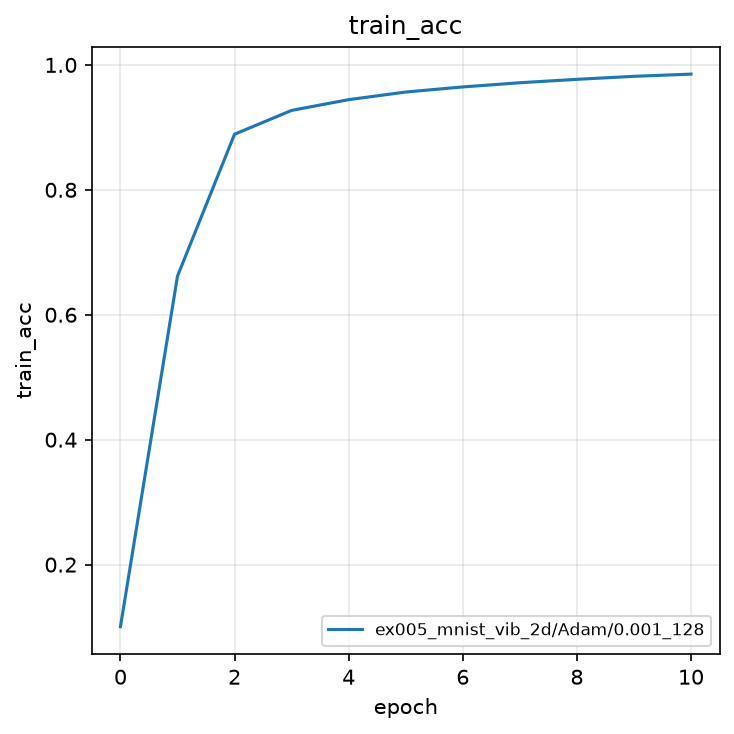
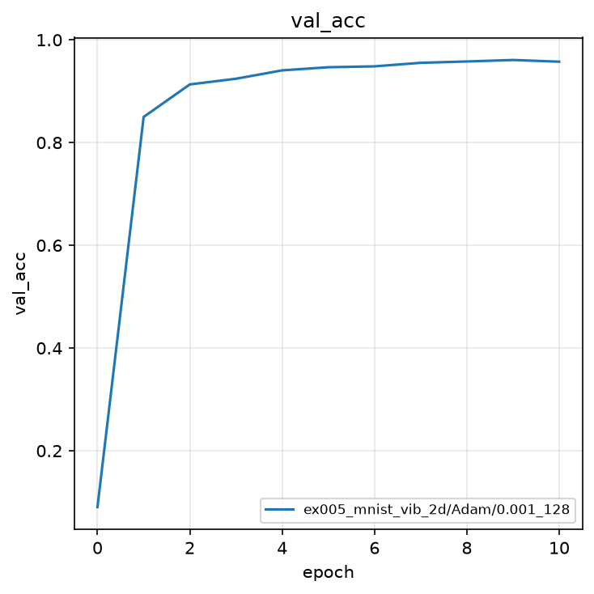
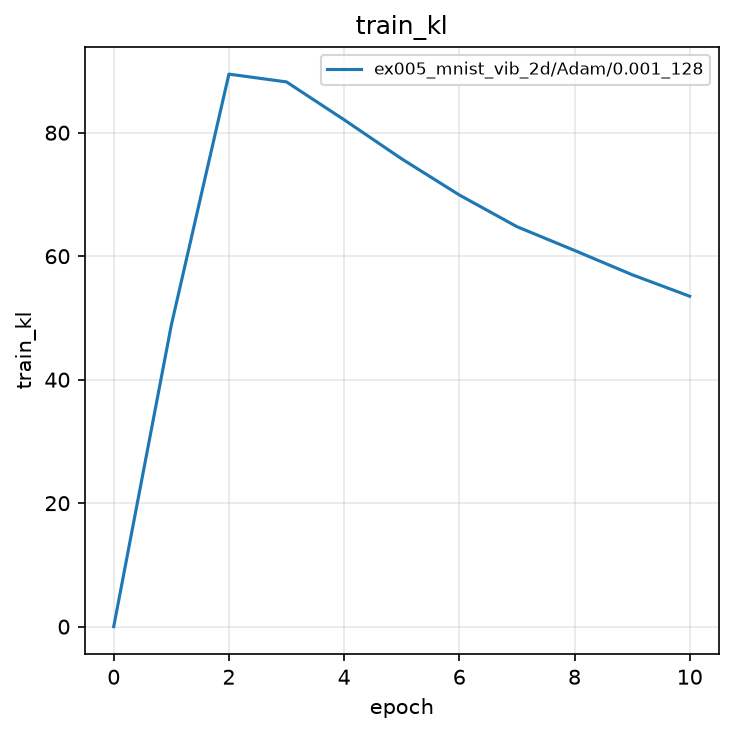
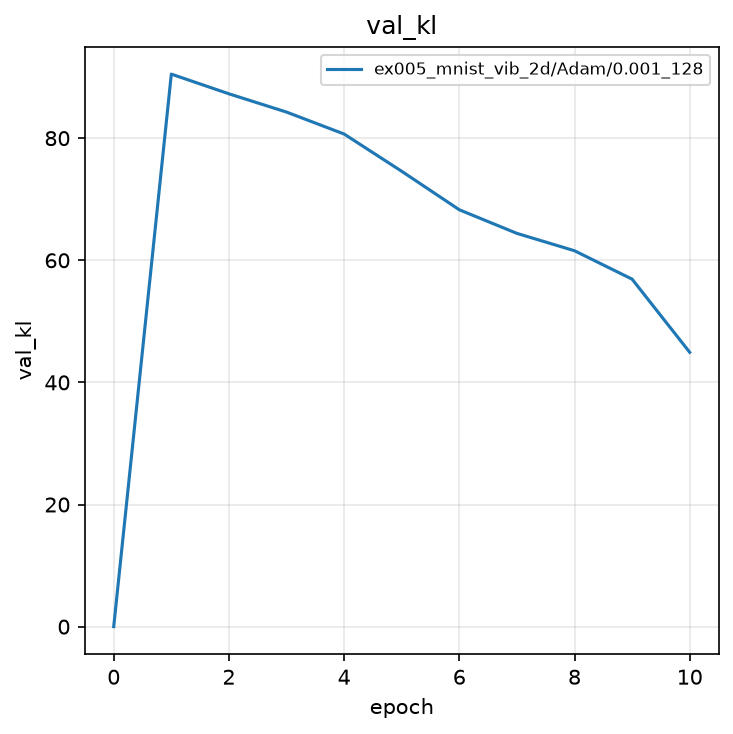
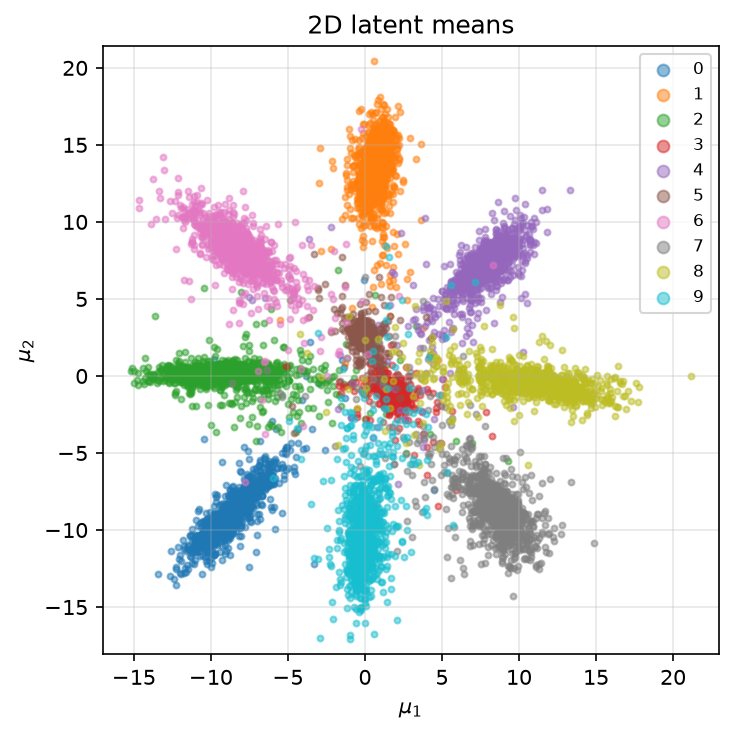
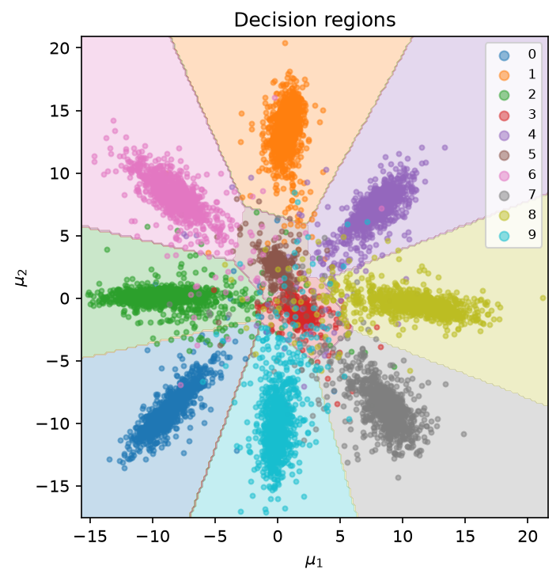

# 実験005: Deep VIB の 2 次元特徴マップの可視化

## 1. 目的

本実験の目的は，実験004の Deep Variational Information Bottleneck（Deep VIB）の潜在次元を 2 に制限し，潜在平均 $\mu \in \mathbb{R}^2$ をクラスごとに散布図として可視化することである．ボトルネック $Z$ に残る識別情報が平面上でどのように配置されるかを確認する．

## 2. 手法

### 2.1 モデル

構造は実験004と同一であり，潜在次元のみ $J=2$ とする．

Encoder:

$$
h_1 = \mathrm{ReLU}(W_1^{(e)}\tilde{x} + b_1^{(e)}) \in \mathbb{R}^{256}
$$

$$
h_2 = \mathrm{ReLU}(W_2^{(e)} h_1 + b_2^{(e)}) \in \mathbb{R}^{128}
$$

$$
\mu = W_\mu h_2 + b_\mu \in \mathbb{R}^{2},\quad
\log\sigma^2 = W_{\log\sigma^2} h_2 + b_{\log\sigma^2} \in \mathbb{R}^{2}
$$

Reparameterization Trick により $z = \mu + \epsilon \odot \exp(0.5\log\sigma^2)$ を得て，分類器 $\ell = W_{\mathrm{out}} z + b_{\mathrm{out}} \in \mathbb{R}^{10}$ でロジットを計算する．

可視化ではサンプリングを行わず，検証画像ごとの $\mu$ を座標 $(\mu_1, \mu_2)$ として用いる．

### 2.2 決定領域の計算

決定領域（分離領域）は，散布した点の密度から境界を推定するのではなく，**潜在平面を格子に切って分類器へ通す**ことで求める．手順は次のとおりである．

1. 検証データの $\mu$ の最小・最大に余白 $0.5$ を足し，描画範囲 $[x_{\min}, x_{\max}]\times[y_{\min}, y_{\max}]$ を決める
2. 各軸を $n_{\mathrm{grid}}=200$ 点で等間隔に区切り，格子点 $z_{i,j}\in\mathbb{R}^{2}$ を作る（合計 $200\times 200$ 点）
3. 各格子点を線形分類器 `classify` に通し，予測クラス $\hat{y}_{i,j}=\arg\max_k (W z_{i,j}+b)_k$ を得る
4. `contourf` で格子の予測クラスを色面として塗り，その上に検証データの $\mu$ を散布する

背景色は「その座標の $z$ を分類器に入れたときにどのクラスになるか」である．分類器は線形なので，領域の境界は直線に近い．

### 2.3 誤差関数

実験004と同じ VIB 損失である．

$$
\mathcal{L} = \mathcal{L}_{\mathrm{CE}} + \beta \mathcal{L}_{\mathrm{KL}},\quad \beta=0.001
$$

$\mathcal{L}_{\mathrm{CE}}$ は交差エントロピー，$\mathcal{L}_{\mathrm{KL}}$ は $q(z|x)$ と $p(z)=\mathcal{N}(0,I)$ の KL ダイバージェンスである．

### 2.4 評価指標

評価指標は Accuracy と KL である．最良モデルの選択基準は検証 Accuracy の最大値である．特徴マップは検証 10,000 枚の $\mu$ を用いて描画する．

## 3. 実験条件

| 項目 | 設定 |
|:---|:---|
| データセット | MNIST（学習 60,000 枚，テスト 10,000 枚） |
| 前処理 | `ToTensor()`（画素値を $[0, 1]$ へ変換） |
| モデル | 全結合 Deep VIB（Encoder 784-256-128-($\mu$,$\log\sigma^2$)，Classifier 2-10） |
| 潜在次元 | $2$ |
| $\beta$ | $0.001$ |
| 最適化手法 | Adam |
| 学習率 | $0.001$ |
| バッチサイズ | $128$ |
| エポック数 | $10$（0 エポック目は初期値評価） |
| シード | $0$（サンプルのため 1 つ） |
| 最良モデルの基準 | 検証 Accuracy の最大値 |

結果の保存先は `outputs/ex005_mnist_vib_2d/Adam/0.001_128/0/` である．

## 4. 実験結果

学習は完了した．0 エポック目の検証 Accuracy は $0.0903$ である．9 エポック目に最高値 $0.9608$ を記録した．潜在平均 $\mu$ による検証 Accuracy は $0.9604$ である．

| epoch | train Loss | train acc | train KL | val Loss | val acc | val KL |
|:---:|:---:|:---:|:---:|:---:|:---:|:---:|
| 0 | 2.5315 | 0.1007 | 0.0033 | 2.5416 | 0.0903 | 0.0034 |
| 1 | 1.0688 | 0.6619 | 48.84 | 0.7110 | 0.8499 | 90.48 |
| 9 | 0.1731 | 0.9817 | 57.00 | 0.2994 | **0.9608** | 56.91 |
| 10 | 0.1472 | 0.9853 | 53.51 | 0.2880 | 0.9575 | 44.93 |

実験004（潜在次元 32）の最良検証 Accuracy $0.9785$ と比べ，2 次元制約により約 $1.8$ ポイント低下した．それでも 10 クラス分類として $96\%$ を超えており，識別に必要な情報の大部分は 2 次元に圧縮できる．

### 4.1 学習曲線

### 4.2 2 次元特徴マップ

検証 10,000 枚の $\mu$ をクラス色でプロットした図である．各クラスは原点付近から放射状に伸びる細長いクラスタを形成する．数字 0, 1, 2, 4, 6, 7, 8, 9 は方位で分離しやすい．数字 3 と 5 は原点付近に集まり，重なりが大きい．

分類器が潜在平面を分割した決定領域である．外周のクラスは直線に近い境界で扇状に分かれる．中心付近では 3 と 5 の領域が入り組み，散布図の重なりと対応する．

## 5. 考察

2 次元ボトルネックでも検証 Accuracy は $0.9608$ に達する．Information Bottleneck の意図どおり，$I(Z; Y)$ に必要な情報は低次元に残り，$I(Z; X)$ の余剰は捨てられる．散布図が放射状になるのは，KL 項が $q(z|x)$ を事前分布 $\mathcal{N}(0,I)$ へ引き寄せ，分類項がクラスごとの方向へ $\mu$ を押し出すためである．原点から遠い点ほどクラスが明確であり，原点付近は複数クラスが混在する．

3 と 5 の重なりは MNIST で知られる字形の類似に対応する．32 次元の実験004ではこの衝突を高次元で回避できたが，2 次元では平面の容量が足りず Accuracy が低下する．次段の敵対的学習では，入力空間での摂動がこの潜在配置をどのように跨ぐかが論点となる．

## 6. まとめ

- 潜在次元 2 の Deep VIB を学習し，最良検証 Accuracy $0.9608$ を得た（32 次元では $0.9785$）．
- 検証データの $\mu$ はクラスごとに放射状のクラスタを形成し，3 と 5 は原点付近で重なる．
- 決定領域は外周で扇状，中心で入り組む配置となり，散布図と一致する．
- 結果は `outputs/ex005_mnist_vib_2d/Adam/0.001_128/0/` に保存した．
