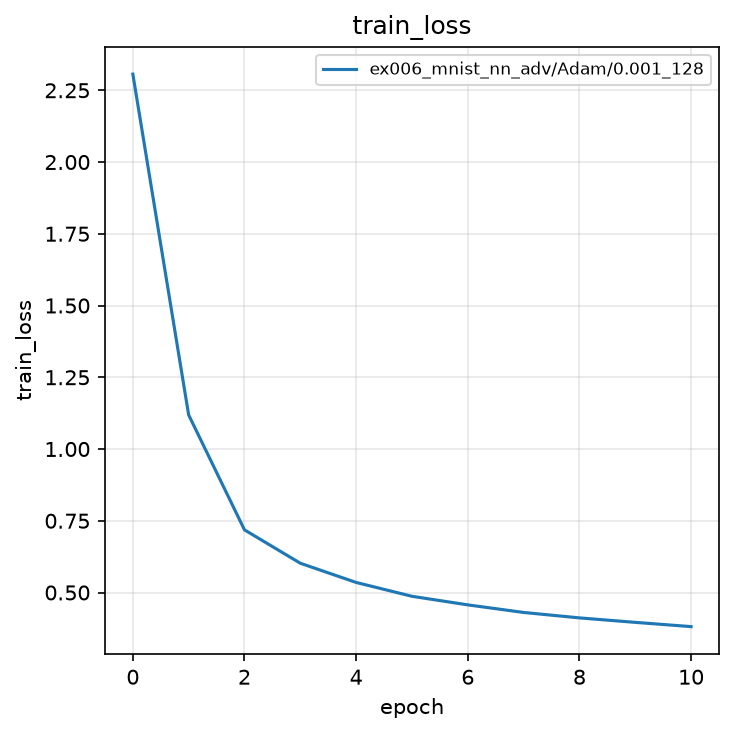
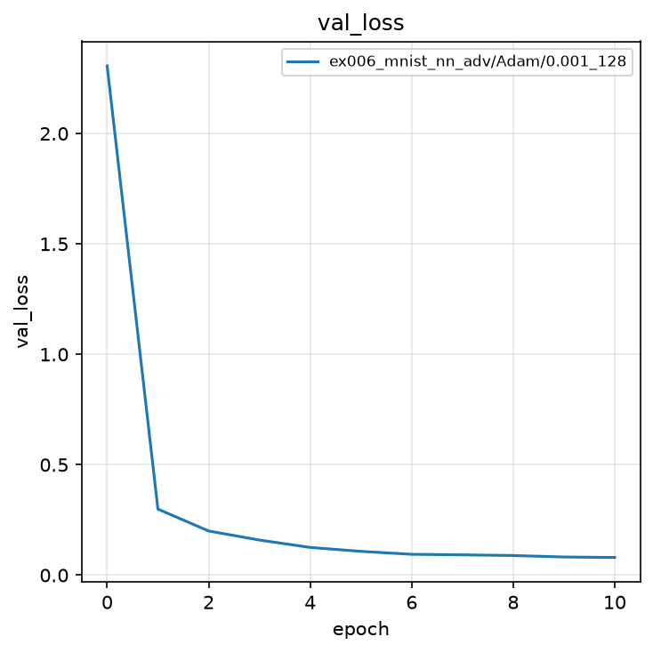
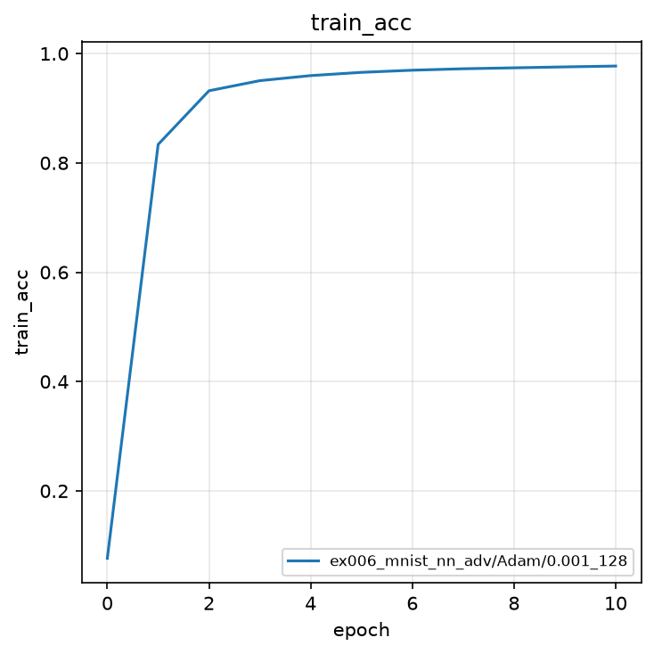
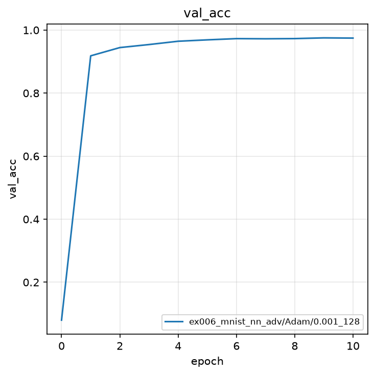
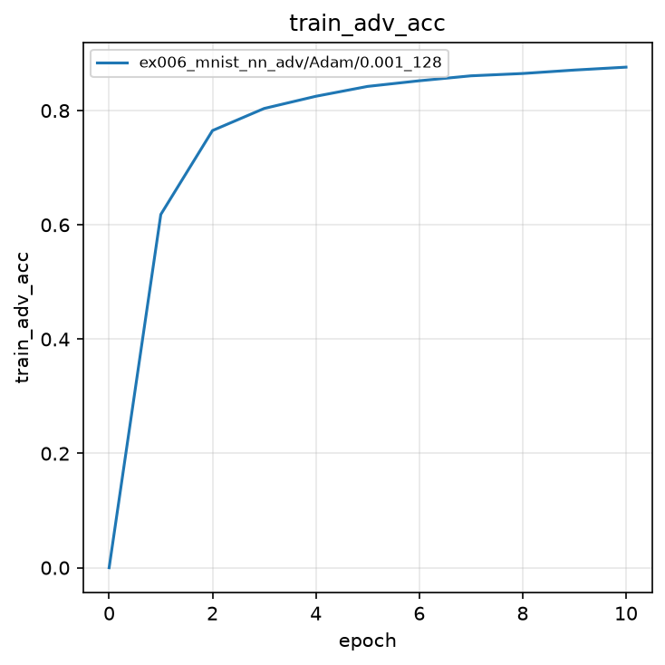
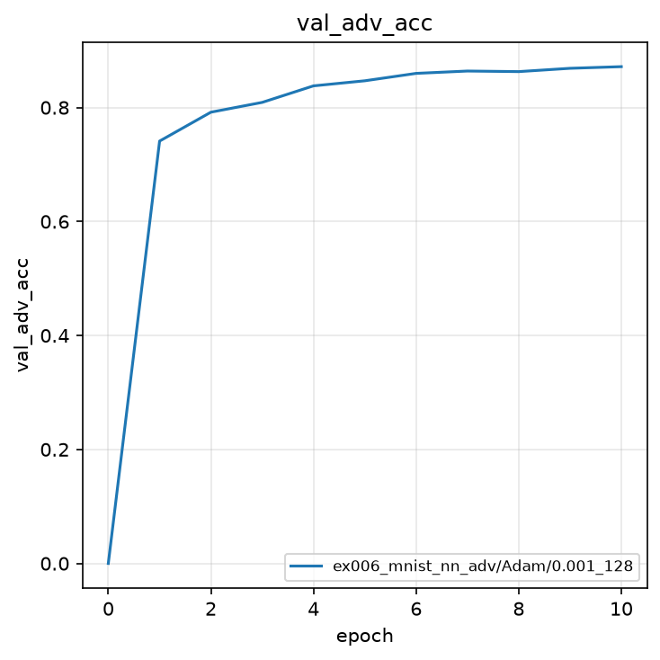
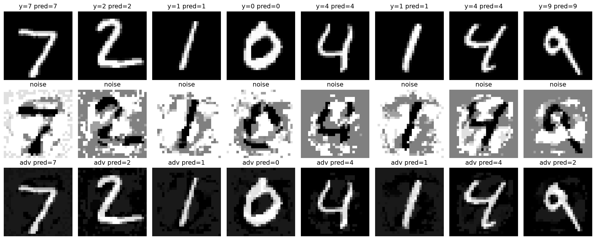

# 実験006: 全結合 NN による MNIST の敵対的学習（ノイズ最適化）

## 1. 目的

本実験の目的は，実験001と同じ全結合ニューラルネットワークに対し，入力へ加えるノイズ $\delta$ を交差エントロピーが大きくなる方向へ最適化し，その摂動画像 $x+\delta$ で学習することである（敵対的学習）．クリーン画像だけでなく，意図的に誤分類を誘う摂動に対する頑健性を確認する．

## 2. 手法

### 2.1 モデル

実験001と同一の 3 層全結合分類器である．入力 $x$ を 784 次元へ平坦化し，

$$
h_{1} = \mathrm{ReLU}(W_{1} \tilde{x} + b_{1}) \in \mathbb{R}^{256}
$$

$$
h_{2} = \mathrm{ReLU}(W_{2} h_{1} + b_{2}) \in \mathbb{R}^{128}
$$

$$
\ell = W_{3} h_{2} + b_{3} \in \mathbb{R}^{10}
$$

予測クラスは $\hat{y} = \operatorname{argmax}_{k} \ell_{k}$ である．

### 2.2 ノイズ最適化（PGD）

固定したモデルに対し，ノイズ $\delta$ を交差エントロピー $\mathcal{L}$ が増える方向へ反復更新する．本実装は **PGD（Projected Gradient Descent，射影付き勾配法）** である．$L_{\infty}$ 球 $\lVert\delta\rVert_{\infty} \le \epsilon$ の中で，誤分類を誘う $\delta$ を多段で求める．初期値は $\delta=0$ である．各ステップ $t$ は

$$
\delta \leftarrow \mathrm{clip}_{[-\epsilon,\epsilon]}\bigl(\delta + \alpha \,\mathrm{sign}(\nabla_{x+\delta}\mathcal{L})\bigr)
$$

としたのち，$x+\delta$ が画素範囲 $[0,1]$ に収まるよう再射影する．ここで $\epsilon=0.1$ は $L_{\infty}$ 半径，$\alpha=0.025$ は 1 ステップの更新幅，反復回数は 5 である．

`optimize_adversarial_noise` の手順は次のとおりである．

1. $\delta \leftarrow 0$ から開始する
2. 固定したモデルに対し，$x+\delta$ で交差エントロピー $\mathcal{L}$ を計算し，入力への勾配 $\nabla_{x+\delta}\mathcal{L}$ を取る
3. $\mathrm{sign}(\nabla_{x+\delta}\mathcal{L})$ の方向へ $\alpha$ だけ更新する（$L_{\infty}$ 向けの符号勾配）
4. 各画素を $[-\epsilon, \epsilon]$ にクリップする（$L_{\infty}$ 球への射影）
5. さらに $x+\delta \in [0,1]$ になるよう画素範囲へ再射影する
6. 手順 2 から 5 を 5 回繰り返す

更新は 1 回だけなら **FGSM（Fast Gradient Sign Method）** に近い．**反復更新と射影** があるため PGD と呼ぶ．Madry らの敵対的学習で用いる $L_{\infty}$ PGD の簡略版と考えてよい．

学習時は，各ミニバッチで PGD により求めた $x+\delta$ を入力としてモデルを更新する．これが **敵対的学習（adversarial training）** である．攻撃（PGD で最悪に近い $\delta$ を求める）と防御（その $x+\delta$ で学習する）を同じ `iteration` 内で行う．

### 2.3 誤差関数

モデルの更新に用いる誤差は実験001と同じ交差エントロピーであるが，入力は $x$ ではなく $x+\delta$ である．

$$
\mathcal{L} = -\frac{1}{N}\sum_{n=1}^{N}\left(\ell_{n,y_{n}} - \log\sum_{k=1}^{10}\exp(\ell_{n,k})\right)
$$

ここで $\ell$ は摂動画像 $x+\delta$ に対するロジット，$y_{n}$ はサンプル $n$ の正解クラスである．

### 2.4 評価指標

評価はクリーン Accuracy と敵対的 Accuracy の 2 つである．後者は，同じ $\epsilon$ と 5 ステップのノイズ最適化を検証データへ適用したあとの正解率である．最良モデルの選択基準は検証の敵対的 Accuracy の最大値である．

## 3. 実験条件

| 項目 | 設定 |
|:---|:---|
| データセット | MNIST（学習 60,000 枚，テスト 10,000 枚） |
| 前処理 | `ToTensor()`（画素値を $[0, 1]$ へ変換） |
| モデル | 全結合 NN（784-256-128-10，ReLU） |
| ノイズ半径 $\epsilon$ | $0.1$（$L_{\infty}$） |
| PGD ステップ数 | $5$ |
| PGD ステップ幅 $\alpha$ | $0.025$ |
| 最適化手法 | Adam |
| 学習率 | $0.001$ |
| バッチサイズ | $128$ |
| エポック数 | $10$（0 エポック目は初期値評価） |
| シード | $0$（サンプルのため 1 つ） |
| 最良モデルの基準 | 検証敵対的 Accuracy の最大値 |

結果の保存先は `outputs/ex006_mnist_nn_adv/Adam/0.001_128/0/` である．

### 実験前に考える

ノートブックを実行する前に，次の問いに自分の言葉で答えよ．

1. 人間にはほぼ同じ画像に見えるのに，AI が間違えるのはなぜか．
2. 入力に小さなノイズを，損失が大きくなる方向へ足すと，Accuracy はどのくらい落ちると考えるか（未学習の分類器と，実験001の学習済み分類器）．
3. Deep VIB のように入力情報を圧縮すると，敵対的摂動に対して強くなると考えるか，弱くなると考えるか．本実験は全結合 NN であるが，その予想を先に書け．


## 4. 実験結果

<details>
<summary>実験結果を見る（先に予想してから開く）</summary>

学習は完了した．0 エポック目（ランダム初期値）の検証クリーン Accuracy は $0.0798$，敵対的 Accuracy は $0.0000$ である．10 エポック目に検証敵対的 Accuracy の最高値 $0.8717$ を記録した．同時点の検証クリーン Accuracy は $0.9746$ である．

| epoch | train Loss | train acc | train adv acc | val Loss | val acc | val adv acc |
|:---:|:---:|:---:|:---:|:---:|:---:|:---:|
| 0 | 2.3063 | 0.0767 | 0.0000 | 2.3060 | 0.0798 | 0.0000 |
| 1 | 1.1188 | 0.8338 | 0.6183 | 0.2992 | 0.9183 | 0.7411 |
| 5 | 0.4868 | 0.9656 | 0.8423 | 0.1077 | 0.9690 | 0.8469 |
| 9 | 0.3960 | 0.9756 | 0.8710 | 0.0821 | 0.9753 | 0.8688 |
| 10 | 0.3812 | 0.9772 | 0.8760 | 0.0800 | 0.9746 | **0.8717** |

実験001のクリーン学習では検証 Accuracy が $0.9808$ である．$\epsilon=0.1$ の敵対的学習ではクリーン Accuracy を $0.97$ 前後に保ったまま，同じ攻撃に対して約 $87\%$ を正しく分類する．

### 4.1 学習曲線













### 4.2 敵対的画像の例



上段が入力，中段が最適化したノイズ（表示のため $[-\epsilon,\epsilon]$ を $[0,1]$ へ線形変換），下段が $x+\delta$ である．検証バッチの正解は 7, 2, 1, 0, 4, 1, 4, 9 である．クリーン予測はすべて一致し，敵対的予測は最後の 9 が 2 へ変わった．

</details>

### 実験後に考える

1. 未学習時の敵対的 Accuracy は $0$ であった．予想と一致したか．
2. クリーン Accuracy は約 $0.97$，敵対的 Accuracy は約 $0.87$ である．「人間には見える数字」と「モデルが使っている手がかり」のずれを，この差で説明できるか．
3. $\epsilon$ を大きくすると，クリーン精度と敵対精度はどちらが先に壊れると考えるか．
4. VIB の圧縮が頑健性に効くかどうかは，本実験だけでは検証していない．どう実験すれば比べられるか．

## 5. 考察

<details>
<summary>解説を見る</summary>

交差エントロピーを入力について最大化する PGD は，モデルが依拠する画素パターンを崩す方向へ $\delta$ を動かす．未学習時の敵対的 Accuracy が $0$ であることは，この方向の変化に分類器が弱いことを示す．

敵対的学習は，PGD で求めた最悪に近い入力 $x+\delta$ を毎ステップの教師として使う．$\epsilon=0.1$ ではクリーン精度を大きく落とさずに，同じ 5 ステップ攻撃へ耐える余白を決定境界に持たせられる．$\epsilon$ を大きくすれば攻撃は強く，学習も難しくなる．

Deep VIB の文脈では，入力の微細な変動（$X$ の余剰情報）に依存しない表現 $Z$ が望ましい．本実験のノイズ最適化は，その余剰が分類器をどれだけ揺らせるかを入力空間で測る手続きである．

</details>

## 6. まとめ

- 実験001と同型の全結合 NN に PGD（$\epsilon=0.1$，5 ステップ，$\alpha=0.025$）による敵対的学習を導入した．
- 最良の検証敵対的 Accuracy は $0.8717$，同時点のクリーン Accuracy は $0.9746$ である．
- 最適化したノイズは小さく見えるが，9 を 2 へ変える例が観測された．
- 結果は `outputs/ex006_mnist_nn_adv/Adam/0.001_128/0/` に保存した．

## 7. 発展課題

### 課題

攻撃の強さ $\epsilon$ を変えて，クリーン精度と敵対精度のトレードオフを測定せよ．

1. **何を変更するか**: `EPSILON = 0.1` を `0.05` と `0.2` にする．`ADV_STEP_SIZE` は半径に合わせて，例えば $\epsilon / 4$ 程度にする．
2. **何を比較するか**: 検証のクリーン Accuracy と敵対的 Accuracy．
3. **予想**: $\epsilon$ が小さいほど敵対精度は高く（攻撃が弱い），$\epsilon$ が大きいほど敵対精度は下がり，クリーン精度も学習が難しくなる．

<details>
<summary>回答例を見る</summary>

```python
EPSILON = 0.2
ADV_STEPS = 5
ADV_STEP_SIZE = 0.05
```

`optimize_adversarial_noise` はすでに `epsilon` と `step_size` を引数に取っているので，定数を変えて再学習すれば十分である．既存の `outputs/ex006_mnist_nn_adv/Adam/0.001_128/0/` は退避せよ．

### 実験方法

各 $\epsilon$ で 10 エポック学習し，最終付近の `val_acc` と `val_adv_acc` を表にまとめよ．

### 期待される結果

$\epsilon=0.05$ では敵対精度は $0.87$ より高くなりやすく，$\epsilon=0.2$ では敵対精度もクリーン精度も下がる．

### 結果から分かること

頑健性は「ただ強いモデル」ではなく，想定する摂動の半径との関係である．VIB で $I(Z;X)$ を削ることが攻撃に効くかは，実験001と同じ攻撃を Deep VIB にかける発展で検証できる．

</details>
