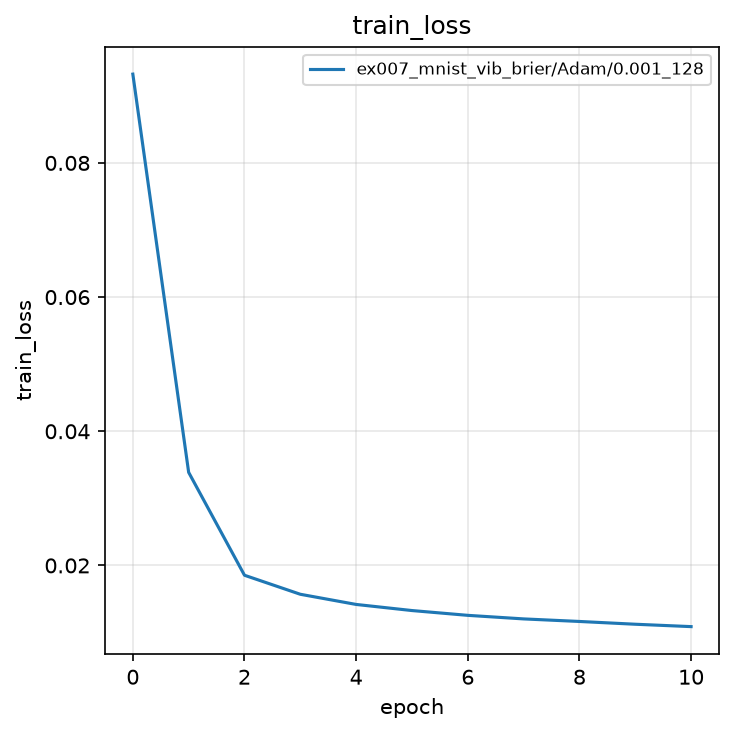
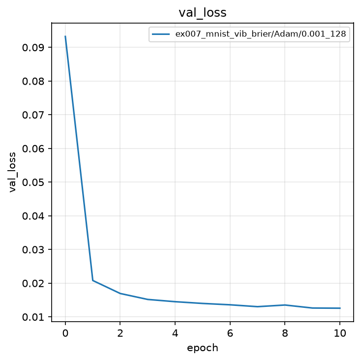
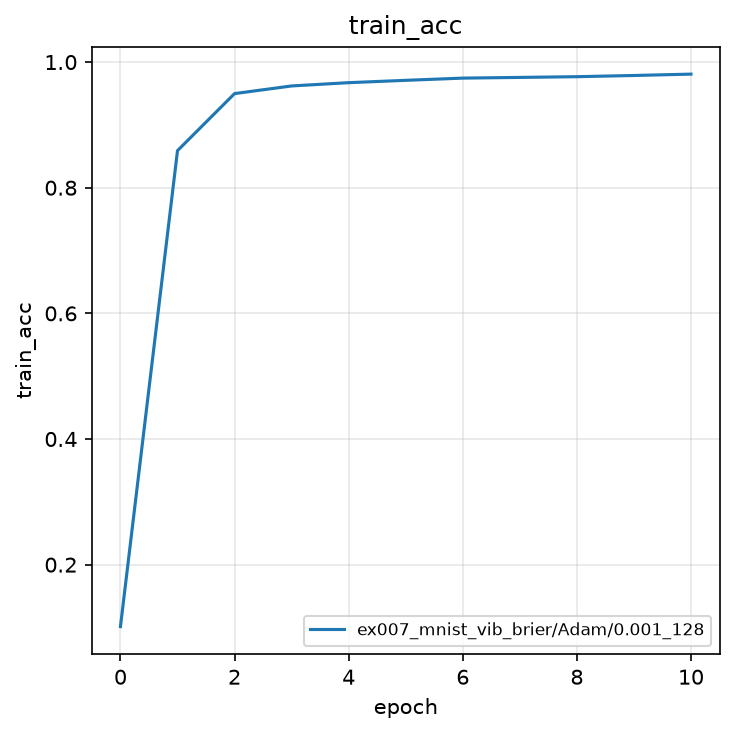
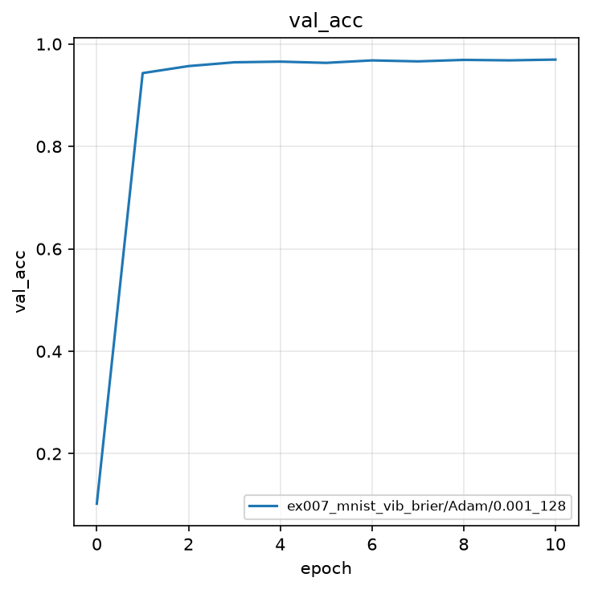
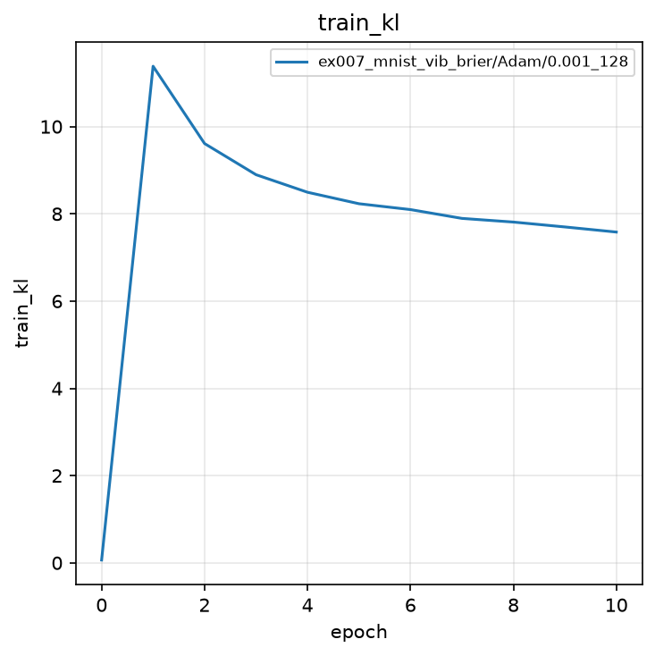
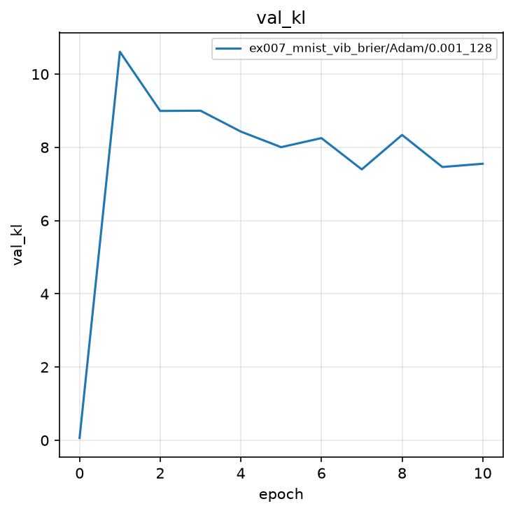
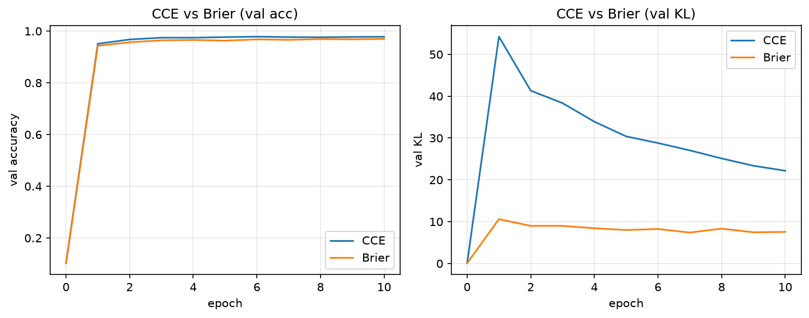
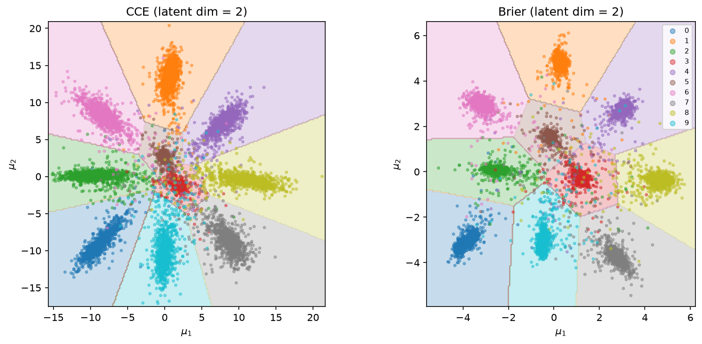

# 実験007: Deep VIB による MNIST 分類（Brier スコア）

## 1. 目的

本実験の目的は，Deep Variational Information Bottleneck（Deep VIB）の分類項として Brier スコアを用い，MNIST を分類することである．ネットワークと KL 正則化は実験004と同一とし，交差エントロピーではなく Brier スコアで確率分布を one-hot 教師へ近づける．CCE 以外の多値分類誤差として，ソフトマックス確率と one-hot の平均二乗誤差を採用する．

## 2. 手法

### 2.1 モデル

実験004と同型である．Encoder は $q(z|x)=\mathcal{N}(\mu, \mathrm{diag}(\sigma^2))$ のパラメータ（各 32 次元）を出力し，Reparameterization Trick で $z$ を得たのち，線形分類器が 10 クラスのロジット $\ell$ を計算する．可視化用の `predict` は $\mu$ を分類器へ渡す．

### 2.2 Brier スコア

Brier スコアは，ソフトマックス確率 $p=\mathrm{softmax}(\ell)$ と one-hot ベクトル $e_y$ の平均二乗誤差である．

$$
\mathcal{L}_{\mathrm{Brier}} = \frac{1}{NC}\sum_{n=1}^{N}\sum_{k=1}^{C}(p_{n,k} - e_{n,k})^2
$$

ここで $C=10$ はクラス数，$e_{n,y_n}=1$，それ以外の成分は $0$ である．$N$ はミニバッチサイズである．交差エントロピーが正解クラスの $-\log p_y$ のみを見るのに対し，Brier スコアは全クラスの確率誤差に罰則を課す．

### 2.3 VIB 損失

KL 項は実験004と同じである．

$$
\mathcal{L}_{\mathrm{KL}} = -\frac{1}{2N}\sum_{n=1}^{N}\sum_{j=1}^{J}\left(1 + \log\sigma_{n,j}^2 - \mu_{n,j}^2 - \sigma_{n,j}^2\right)
$$

ここで $J=32$ は潜在次元である．学習に用いる損失は

$$
\mathcal{L} = \mathcal{L}_{\mathrm{Brier}} + \beta \mathcal{L}_{\mathrm{KL}},\quad \beta=0.001
$$

である．

### 2.4 評価指標

評価指標は Accuracy と KL である．最良モデルの選択基準は検証 Accuracy の最大値である．

## 3. 実験条件

| 項目 | 設定 |
|:---|:---|
| データセット | MNIST（学習 60,000 枚，テスト 10,000 枚） |
| 前処理 | `ToTensor()`（画素値を $[0, 1]$ へ変換） |
| モデル | 実験004と同型の全結合 Deep VIB（潜在次元 32） |
| 分類誤差 | Brier スコア（ソフトマックスと one-hot の MSE） |
| $\beta$ | $0.001$ |
| 最適化手法 | Adam |
| 学習率 | $0.001$ |
| バッチサイズ | $128$ |
| エポック数 | $10$（0 エポック目は初期値評価） |
| シード | $0$（サンプルのため 1 つ） |
| 最良モデルの基準 | 検証 Accuracy の最大値 |

結果の保存先は `outputs/ex007_mnist_vib_brier/Adam/0.001_128/0/` である．

## 4. 実験結果

学習は完了した．0 エポック目の検証 Accuracy は $0.1023$ である．10 エポック目に最高値 $0.9696$ を記録した．KL は学習開始直後に上昇したのち $7.6$ 前後へ収束した．

| epoch | train Loss | train acc | train KL | val Loss | val acc | val KL |
|:---:|:---:|:---:|:---:|:---:|:---:|:---:|
| 0 | 0.0932 | 0.1014 | 0.0649 | 0.0932 | 0.1023 | 0.0650 |
| 1 | 0.0339 | 0.8590 | 11.38 | 0.0208 | 0.9432 | 10.61 |
| 6 | 0.0126 | 0.9745 | 8.10 | 0.0136 | 0.9680 | 8.25 |
| 10 | 0.0109 | 0.9808 | 7.58 | 0.0126 | **0.9696** | 7.55 |

実験004（交差エントロピー + KL）の最良検証 Accuracy は $0.9785$，最終付近の KL は約 $22$ であった．本実験は Accuracy が約 $0.9$ ポイント低く，KL はより小さい．

### 4.1 学習曲線

### 4.2 予測例

検証バッチの数字 7, 2, 1, 0, 4, 1, 4, 9 はいずれも正解ラベルと一致した．

### 4.3 交差エントロピーとの比較

同じ Deep VIB 骨格・同じ $\beta=0.001$ で，分類項だけを CCE と Brier にした場合を並べる．

| 条件 | 潜在次元 | 最良 val acc | 最終 val KL |
|:---|:---:|:---:|:---:|
| CCE | 32 | $0.9785$ | $22.18$ |
| Brier | 32 | $0.9696$ | $7.55$ |
| CCE | 2 | $0.9608$ | $44.93$ |
| Brier | 2 | $0.9654$ | $7.89$ |

潜在 32 次元では CCE の Accuracy が約 $0.9$ ポイント高い．一方 KL は Brier の方が小さく，同じ $\beta$ でも圧縮が強く効く．潜在 2 次元では Brier の Accuracy がわずかに上回る．

左が検証 Accuracy，右が検証 KL である．Accuracy は終盤まで近く，KL は序盤から Brier の方が低い．

左が CCE，右が Brier である．どちらも原点から放射状にクラスが並ぶ．CCE の $\mu$ はおおよそ $[-15,20]$ まで広がり，Brier は $[-6,6]$ 程度に収まる．決定領域は実験005と同じく，潜在平面の $200\times 200$ 格子を `classify` に通して塗っている．$\mu$ からの検証 Accuracy は CCE $0.9604$，Brier $0.9642$ である．

## 5. 考察

Brier スコアは多クラス分類のキャリブレーション指標として知られ，確率ベクトル全体を教師 one-hot へ近づける．VIB の KL 項と組み合わせると，交差エントロピーより勾配が全クラスに分散しやすく，同じ $\beta$ では潜在表現の圧縮（KL 低減）が強く効く．2 次元可視化でも，Brier のクラスタは原点付近にコンパクトに集まり，CCE はより遠くへ伸びる．

講座の最終実験として，Deep VIB の分類項を Brier スコアとした．実験001（CE），実験004（CE + KL），本実験（Brier + KL）は，いずれも `loss_func` の差し替えだけで完結する．

## 6. まとめ

- Deep VIB の分類項を Brier スコアとし，最良検証 Accuracy $0.9696$ を得た．
- 同じ骨格の CCE と比べ，Accuracy は 32 次元で約 $0.9$ ポイント低く，KL は約 $22$ から約 $7.6$ へ小さくなった．
- 2 次元ではどちらも放射状の配置になるが，Brier の方が原点近くに圧縮される．
- 結果は `outputs/ex007_mnist_vib_brier/` に保存した．
