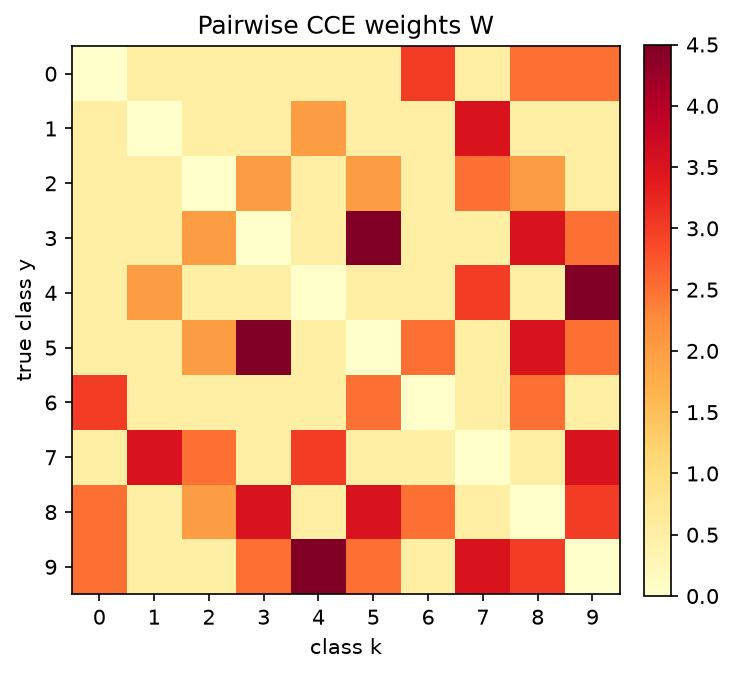
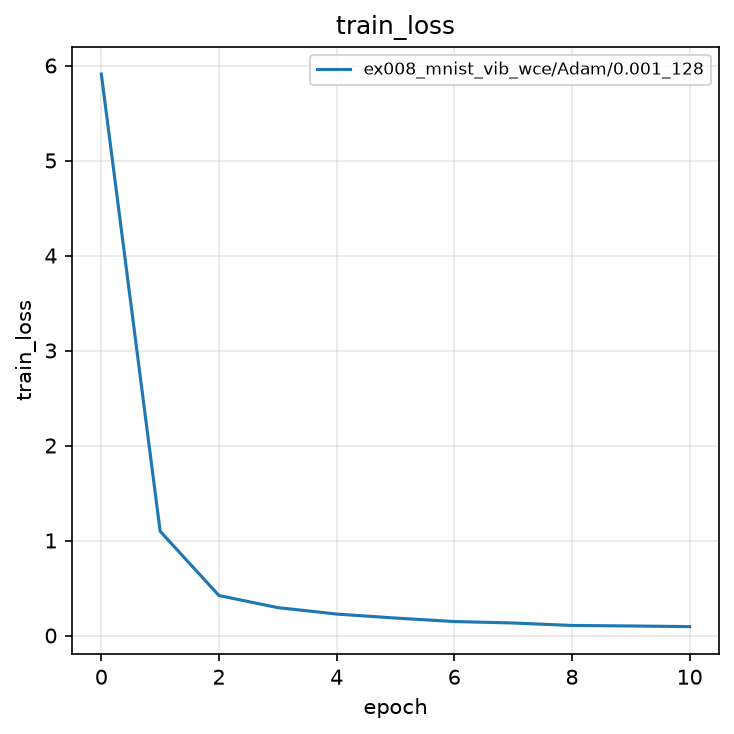
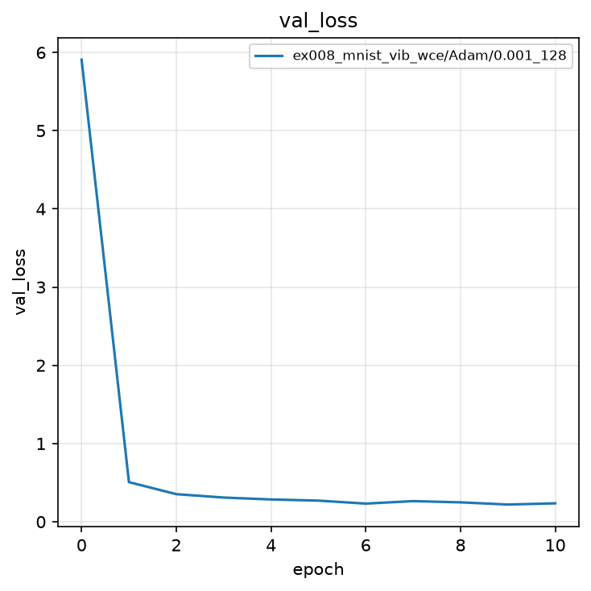
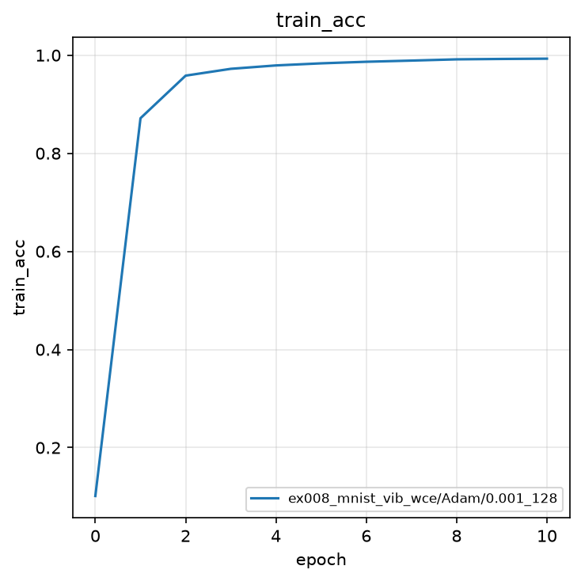
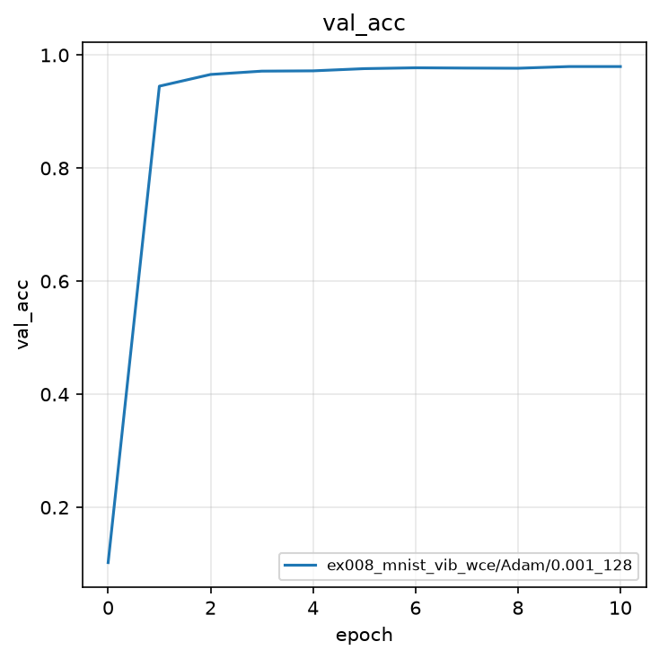
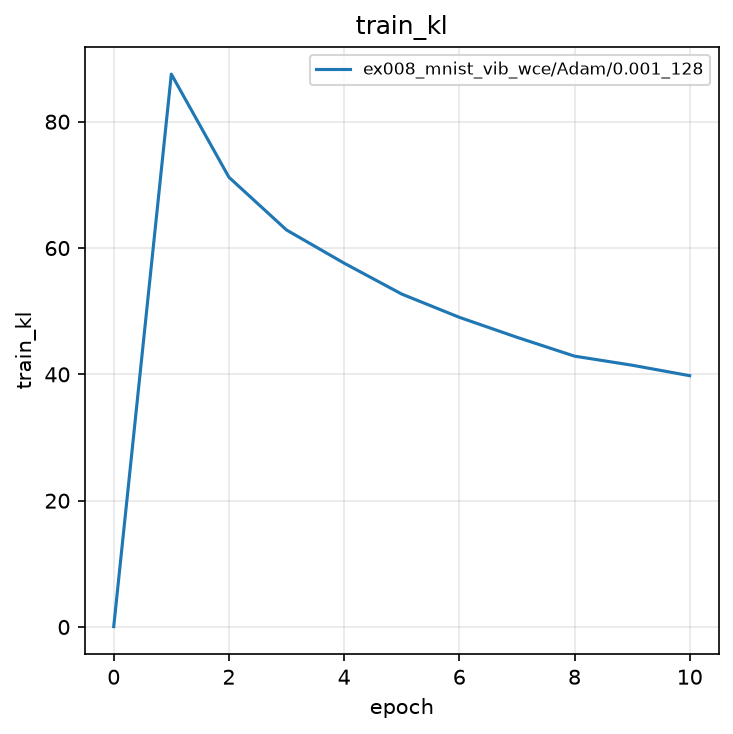
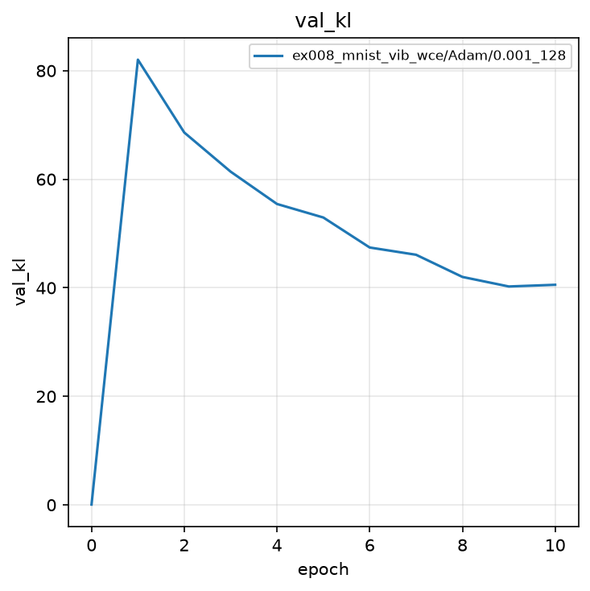
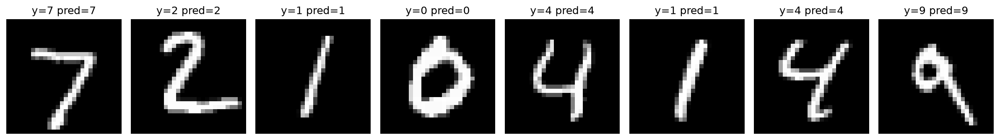
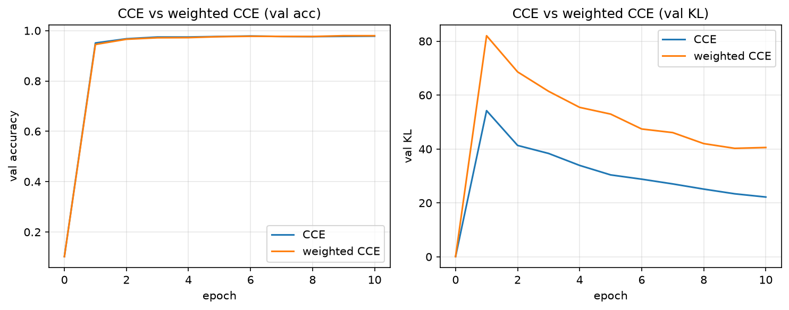
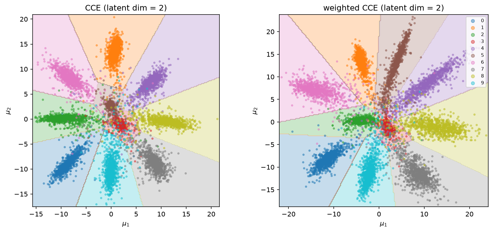

# 実験008: Deep VIB による MNIST 分類（クラス間重み付き CCE）

## 1. 目的

本実験の目的は，実験004と同じ Deep Variational Information Bottleneck（Deep VIB）で MNIST を分類しつつ，**似た数字同士を取り違えたときの損失を大きくする**ことである．交差エントロピー（CCE）そのものは残し，クラス間の重みで CCE をスケールする．

## 2. 手法

### 2.1 モデル

実験004と同型である．Encoder は $q(z|x)=\mathcal{N}(\mu, \mathrm{diag}(\sigma^2))$ のパラメータ（各 32 次元）を出力し，Reparameterization Trick で $z$ を得たのち，線形分類器が 10 クラスのロジット $\ell$ を計算する．可視化用の `predict` は $\mu$ を分類器へ渡す．

### 2.2 クラス間重み

$(y,k)$ の組み合わせは $10\times 10=100$ 通りある．$W_{yk}=W_{ky}$ と対称にすると保持する値は半分の **50 個** になる．これを長さ 50 のベクトル `PAIR_WEIGHT_VEC` としてノートブック内にハードコーディングし，対称な $10\times 10$ 行列へ展開する．学習結果ディレクトリにも `pair_weights.json` として保存する．

内訳は次のとおりである．

- 先頭 45 個: 異なるクラスの無順対 $(i,j)$（$i<j$，辞書式）．$C(10,2)=45$
- 末尾 5 個: 対角 $W_{00},\ldots,W_{44}$（混同項では 0 とし，使わない）
- 残りの対角 $W_{55},\ldots,W_{99}$ は展開時に 0

似た数字ほど大きい値にする．例として $W_{3,5}=W_{5,3}=4.5$，$W_{4,9}=4.5$，$W_{1,7}=3.5$ である．見た目が大きく違う対は $0.5$ とする．

### 2.3 重み付き CCE と VIB 損失

$p=\mathrm{softmax}(\ell)$ として，

$$
\mathcal{L}_{\mathrm{WCCE}}
= -\frac{1}{N}\sum_{n=1}^{N}
\left(1 + \sum_{k\neq y_n} W_{y_n k}\, p_{n,k}\right)
\log p_{n,y_n}
$$

である．括弧内は通常の CCE に対する倍率である．正解 $y$ のサンプルが，似たクラス $k$ へ確率を漏らすほど倍率が 1 より大きくなり，$-\log p_y$ が強調される．

KL 項は実験004と同じである．学習損失は

$$
\mathcal{L} = \mathcal{L}_{\mathrm{WCCE}} + \beta \mathcal{L}_{\mathrm{KL}},\quad \beta=0.001
$$

である．$\beta$ は実験003の VAE と同じ値である．

### 2.4 評価指標

評価指標は Accuracy と KL である．最良モデルの選択基準は検証 Accuracy の最大値である．

## 3. 実験条件

| 項目 | 設定 |
|:---|:---|
| データセット | MNIST（学習 60,000 枚，テスト 10,000 枚） |
| 前処理 | `ToTensor()` |
| モデル | 実験004と同型の全結合 Deep VIB（潜在次元 32） |
| 分類誤差 | クラス間重み付き CCE（50 個の対称重み） |
| $\beta$ | $0.001$ |
| 最適化手法 | Adam |
| 学習率 | $0.001$ |
| バッチサイズ | $128$ |
| エポック数 | $10$（0 エポック目は初期値評価） |
| シード | $0$ |
| 最良モデルの基準 | 検証 Accuracy の最大値 |

結果の保存先は `outputs/ex008_mnist_vib_wce/Adam/0.001_128/0/` である．

### 実験前に考える

ノートブックを実行する前に，次の問いに自分の言葉で答えてください．

1. 3 を 4 と間違えることと，3 を 8 と間違えることは，同じ間違いでしょうか．
2. クラス間の類似性を損失関数に組み込むと，Accuracy や潜在空間の配置は何が変わると思いますか．
3. その「似ている」という関係は，誰が，どのように決めるべきでしょうか（人手の字形，混同行列，学習可能な重み，など）．
4. 重み付き CCE は通常の CCE と勾配の向きが近いので，2 次元散布は同じ形のままスケールだけ変わると思いますか．それとも配置自体が変わると思いますか．


## 4. 実験結果

<details>
<summary>実験結果を見る（先に予想してから開く）</summary>

学習は完了した．0 エポック目の検証 Accuracy は $0.1023$ である．9 エポック目と 10 エポック目に最高値 $0.9797$ を記録した．

| epoch | train Loss | train acc | train KL | val Loss | val acc | val KL |
|:---:|:---:|:---:|:---:|:---:|:---:|:---:|
| 0 | 5.909 | 0.1014 | 0.065 | 5.907 | 0.1023 | 0.065 |
| 1 | 1.097 | 0.8716 | 87.53 | 0.507 | 0.9450 | 82.03 |
| 6 | 0.147 | 0.9866 | 49.03 | 0.232 | 0.9775 | 47.42 |
| 9 | 0.100 | 0.9924 | 41.45 | 0.220 | **0.9797** | 40.24 |
| 10 | 0.094 | 0.9929 | 39.79 | 0.236 | **0.9797** | 40.55 |

実験004（通常 CCE）の最良検証 Accuracy は $0.9785$，最終 KL は約 $22$ である．本実験は Accuracy がわずかに高く，KL は大きい．重み付き CCE のスケールが通常 CCE より大きいため，同じ $\beta$ でも KL 項の相対的な効きが弱くなる．

### 4.1 クラス間重み



3 と 5，4 と 9 など字形が近い対が濃く，無関係な対は薄い．行列は対称である．

### 4.2 学習曲線













### 4.3 予測例



検証バッチの数字 7, 2, 1, 0, 4, 1, 4, 9 はいずれも正解と一致した．

### 4.4 交差エントロピーとの比較

同じ Deep VIB 骨格・同じ $\beta=0.001$ で，分類項だけを CCE と重み付き CCE にした場合を並べる．

| 条件 | 潜在次元 | 最良 val acc | 最終 val KL |
|:---|:---:|:---:|:---:|
| CCE | 32 | $0.9785$ | $22.18$ |
| 重み付き CCE | 32 | $0.9797$ | $40.55$ |
| CCE | 2 | $0.9608$ | $44.93$ |
| 重み付き CCE | 2 | $0.9538$ | $79.86$ |

潜在 32 次元では Accuracy はほぼ同じで，KL は重み付き CCE の方が大きい．潜在 2 次元では重み付き CCE の Accuracy が約 $0.7$ ポイント低く，KL も大きい．倍率が損失の尺度を押し上げるため，同じ $\beta$ では圧縮が弱くなる．



左が検証 Accuracy，右が検証 KL である．Accuracy は終盤まで近く，KL は序盤から重み付き CCE の方が高い．



左が CCE，右が重み付き CCE である．どちらも原点から放射状にクラスが並び，方位の割り当てはほぼ同じである．重み付き CCE は $ -\log p_y $ に倍率を掛けるだけなので，勾配の向きは通常の CCE に近く，扇状の配置は保たれる．一方 $\mu$ の範囲は CCE がおおよそ $[-15,21]$，重み付き CCE が $[-22,24]$ と広く，数字 5 のクラスタはやや伸びる．決定領域は実験005と同じく，潜在平面の $200\times 200$ 格子を `classify` に通して塗っている．$\mu$ からの検証 Accuracy は CCE $0.9604$，重み付き CCE $0.9538$ である．

</details>

### 実験後に考える

1. 32 次元の Accuracy は通常の CCE とほぼ同じでした．「損失を変えたのに精度が同じなら意味がない」と言えますか．
2. 2 次元では配置の方位はほぼ同じで，スケールと KL が変わりました．実験前の予想と一致しましたか．なぜ Brier ほど配置が変わらないのでしょうか．
3. $W_{3,5}$ を人手で $4.5$ にしたことは妥当でしょうか．データから決めるには，何を観測すればよいですか．

## 5. 考察

<details>
<summary>解説を見る</summary>


通常の CCE は $-\log p_y$ のみを見る．本実験では，似たクラスへ漏れた確率 $p_k$ が倍率を押し上げる．32 次元では Accuracy は実験004と同水準かそれ以上であり，重み付けが学習を壊していない．

2 次元では扇状のクラス配置は CCE とほぼ同じ方位になる．重み付き CCE は異なる誤差だが，勾配の向きは「正解確率を上げる」ままなので，Brier スコアほど配置は変わらない．変わるのはスケールである．同じ初期値とミニバッチ順は方位の一致を助け，損失の差は $\mu$ の広がりと KL に現れる．潜在 2 次元では容量が足りず，混同を強く罰する効果が Accuracy のわずかな低下として出る．

50 個の重みは学習パラメータではなく，字形の類似に基づく定数である．対を増やしたり値を変えたりしても，`PAIR_WEIGHT_VEC` を書き換えるだけでよい．

</details>

## 6. まとめ

- Deep VIB の分類項をクラス間重み付き CCE とし，最良検証 Accuracy $0.9797$ を得た．
- クラス間重みは 50 個のベクトルとして保持し，対称な $10\times 10$ 行列へ展開した．
- 実験004（$0.9785$）と同水準の Accuracy で，似た数字の混同に対する罰則を明示できる．
- 2 次元では CCE と同じ放射状配置になるが，$\mu$ の範囲は広く，検証 Accuracy は $0.9538$ とやや低い．
- 結果は `outputs/ex008_mnist_vib_wce/` に保存した．

## 7. 発展課題

### 課題

「似ている」対の重みを意図的に入れ替え，2 次元配置や混同の仕方が変わるかを調べてください．

1. **何を変更するか**: `build_pair_weight_vector` 内の `similar` で，例えば $(3,5)$ を $0.5$ に下げ，逆に $(0,1)$ のような不自然な対を $4.5$ にする．
2. **何を比較するか**: 検証 Accuracy，2 次元の $\mu$ 散布（3 と 5 の重なり，0 と 1 の位置），可能なら混同行列．
3. **予想**: 3 と 5 の罰を弱めると，2 次元では両者の重なりが残るか増えます．無関係な対を強く罰しても，字形が違うため配置はあまり動かないかもしれません．

<details>
<summary>回答例を見る</summary>

```python
similar = {
    (0, 1): 4.5,  # 不自然に大きくする例
    (3, 5): 0.5,  # 本来似ている対を弱める
    # 他の対は元の辞書からコピーしてよい
}
```

長さ 50 のベクトル規約（$i<j$ の 45 個 + 対角 5 個）は変えないでください．比較用の 2 次元学習は，ノートブック後半の `COMPARISON_SETTINGS` で `("wce", 2)` を再実行します．既存の `compare/wce_2/` を退避してから学習してください．

### 実験方法

元の重みと改変した重みで，潜在 2 次元の散布図と検証 Accuracy を並べます．

### 期待される結果

$(3,5)$ を弱めると 3 と 5 の境界が甘くなり，Accuracy がわずかに変わることがあります．$(0,1)$ を強くしても，0 と 1 はもともと離れやすいので，配置の変化は限定的です．

### 結果から分かること

損失の設計は「何を間違えてほしくないか」の宣言です．類似度を人手で置くことは可能ですが，その妥当性はデータと目的に依存します．混同行列から $W$ を作る，あるいは $W$ を学習する，が次の研究的な問いです．

</details>
